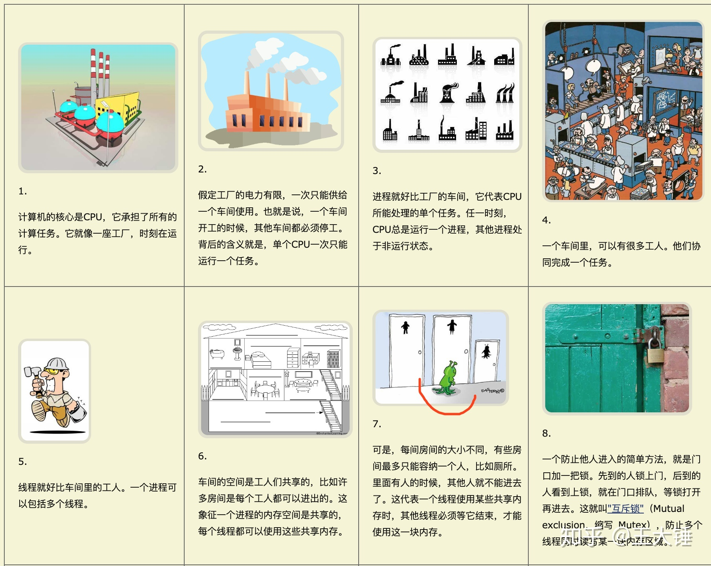

## 进程 (process) 和线程 (thread)

进程（process）和线程（thread）是操作系统的基本概念。

**进程是 CPU 资源分配的最小单位（是能拥有资源和独立运行的最小单位）。**

**线程是 CPU 调度的最小单位（是建立在进程基础上的一次程序运行单位）。**

现代操作系统都是可以同时运行多个任务的,比如:用浏览器上网的同时还可以听音乐。

**对于操作系统来说,一个任务就是一个进程**,比如打开一个浏览器就是启动了一个浏览器进程,打开一个 Word 就启动了一个 Word 进程。

有些进程同时不止做一件事,比如 Word,它同时可以进行打字、拼写检查、打印等事情。**在一个进程内部,要同时做多件事,就需要同时运行多个“子任务”,我们把进程内的这些“子任务”称为线程**。

由于每个进程至少要做一件事,所以一个进程至少有一个线程。系统会给每个进程分配独立的内存,因此进程有它独立的资源。同一进程内的各个线程之间共享该进程的内存空间（包括代码段,数据集,堆等）。

借用一个生动的比喻来说,进程就像是一个有边界的生产厂间,而线程就像是厂间内的一个个员工,可以自己做自己的事情,也可以相互配合做同一件事情。

当我们启动一个应用,计算机会创建一个进程,操作系统会为进程分配一部分内存,应用的所有状态都会保存在这块内存中。

应用也许还会创建多个线程来辅助工作,这些线程可以共享这部分内存中的数据。如果应用关闭,进程会被终结,操作系统会释放相关内存。

## 浏览器的多进程架构

一个好的程序常常被划分为几个相互独立又彼此配合的模块,浏览器也是如此。

以 Chrome 为例,它由多个进程组成,每个进程都有自己核心的职责,它们相互配合完成浏览器的整体功能,

每个进程中又包含多个线程,一个进程内的多个线程也会协同工作,配合完成所在进程的职责。

Chrome 采用多进程架构,其顶层存在一个 Browser process 用以协调浏览器的其它进程。

### 优点

由于默认 新开 一个 tab 页面 新建 一个进程,所以单个 tab 页面崩溃不会影响到整个浏览器。

同样,第三方插件崩溃也不会影响到整个浏览器。

多进程可以充分利用现代 CPU 多核的优势。

方便使用沙盒模型隔离插件等进程,提高浏览器的稳定性。

### 缺点

系统为浏览器新开的进程分配内存、CPU 等资源,所以内存和 CPU 的资源消耗也会更大。

不过 Chrome 在内存释放方面做的不错,基本内存都是能很快释放掉给其他程序运行的。

## 浏览器的主要进程和职责

### 主进程 Browser Process

> 负责浏览器界面的显示与交互。各个页面的管理,创建和销毁其他进程。网络的资源管理、下载等。

### 第三方插件进程 Plugin Process

> 每种类型的插件对应一个进程,仅当使用该插件时才创建。

### GPU 进程 GPU Process

> 最多只有一个,用于 3D 绘制等

### 渲染进程 Renderer Process

> 称为浏览器渲染进程或浏览器内核,内部是多线程的。主要负责页面渲染,脚本执行,事件处理等。 (本文重点分析)

## 渲染进程 (浏览器内核)

浏览器的渲染进程是多线程的,我们来看看它有哪些主要线程 :

### 1. GUI 渲染线程

- 负责渲染浏览器界面,解析 HTML,CSS,构建 DOM 树和 RenderObject 树,布局和绘制等。

- 当界面需要重绘（Repaint）或由于某种操作引发回流(reflow)时,该线程就会执行。

- 注意,GUI 渲染线程与 JS 引擎线程是互斥的,当 JS 引擎执行时 GUI 线程会被挂起（相当于被冻结了）,GUI 更新会被保存在一个队列中等到 JS 引擎空闲时立即被执行。

### 2. JS 引擎线程

- Javascript 引擎,也称为 JS 内核,负责处理 Javascript 脚本程序。（例如 V8 引擎）

- JS 引擎线程负责解析 Javascript 脚本,运行代码。

- JS 引擎一直等待着任务队列中任务的到来,然后加以处理,一个 Tab 页（renderer 进程）中无论什么时候都只有一个 JS 线程在运行 JS 程序。

- 注意,GUI 渲染线程与 JS 引擎线程是互斥的,所以如果 JS 执行的时间过长,这样就会造成页面的渲染不连贯,导致页面渲染加载阻塞。

### 3. 事件触发线程

- 归属于浏览器而不是 JS 引擎,用来控制事件循环（可以理解,JS 引擎自己都忙不过来,需要浏览器另开线程协助）

- 当 JS 引擎执行代码块如 setTimeOut 时（也可来自浏览器内核的其他线程,如鼠标点击、AJAX 异步请求等）,会将对应任务添加到事件线程中

- 当对应的事件符合触发条件被触发时,该线程会把事件添加到待处理队列的队尾,等待 JS 引擎的处理

- 注意,由于 JS 的单线程关系,所以这些待处理队列中的事件都得排队等待 JS 引擎处理（当 JS 引擎空闲时才会去执行）

### 4. 定时触发器线程

- 传说中的 setInterval 与 setTimeout 所在线程

- 浏览器定时计数器并不是由 JavaScript 引擎计数的,（因为 JavaScript 引擎是单线程的, 如果处于阻塞线程状态就会影响记计时的准确）

- 因此通过单独线程来计时并触发定时（计时完毕后,添加到事件队列中,等待 JS 引擎空闲后执行）

- 注意,W3C 在 HTML 标准中规定,规定要求 setTimeout 中低于 4ms 的时间间隔算为 4ms。

### 5. 异步 http 请求线程

- 在 XMLHttpRequest 在连接后是通过浏览器新开一个线程请求。

- 将检测到状态变更时,如果设置有回调函数,异步线程就产生状态变更事件,将这个回调再放入事件队列中。再由 JavaScript 引擎执行。

## 浏览器渲染流程

如果要讲从输入 url 到页面加载发生了什么,那怕是没完没了了...这里我们只谈谈浏览器渲染的流程。

1. 解析 HTML 文件,构建 DOM 树,同时浏览器主进程负责下载 CSS 文件

2. CSS 文件下载完成,解析 CSS 文件成树形的数据结构,然后结合 DOM 树合并成 RenderObject 树

3. 布局 RenderObject 树 （Layout/reflow）,负责 RenderObject 树中的元素的尺寸,位置等计算

4. 绘制 RenderObject 树 （paint）,绘制页面的像素信息

5. 浏览器主进程将默认的图层和复合图层交给 GPU 进程,GPU 进程再将各个图层合成（composite）,最后显示出页面

## 十万个为什么

### 1. 为什么 Javascript 要是单线程的 ?

这是因为 Javascript 这门脚本语言诞生的使命所致!JavaScript 为处理页面中用户的交互,以及操作 DOM 树、CSS 样式树来给用户呈现一份动态而丰富的交互体验和服务器逻辑的交互处理。

如果 JavaScript 是多线程的方式来操作这些 UI DOM,则可能出现 UI 操作的冲突。

如果 Javascript 是多线程的话,在多线程的交互下,处于 UI 中的 DOM 节点就可能成为一个临界资源,

假设存在两个线程同时操作一个 DOM,一个负责修改一个负责删除,那么这个时候就需要浏览器来裁决如何生效哪个线程的执行结果。

当然我们可以通过锁来解决上面的问题。但为了避免因为引入了锁而带来更大的复杂性,Javascript 在最初就选择了单线程执行。

### 2. 为什么 JS 阻塞页面加载 ?

由于 JavaScript 是可操纵 DOM 的,如果在修改这些元素属性同时渲染界面（即 JavaScript 线程和 UI 线程同时运行）,那么渲染线程前后获得的元素数据就可能不一致了。

因此为了防止渲染出现不可预期的结果,浏览器设置 **GUI 渲染线程与 JavaScript 引擎为互斥**的关系。

当 JavaScript 引擎执行时 GUI 线程会被挂起,GUI 更新会被保存在一个队列中等到引擎线程空闲时立即被执行。

从上面我们可以推理出,由于 GUI 渲染线程与 JavaScript 执行线程是互斥的关系,

当浏览器在执行 JavaScript 程序的时候,GUI 渲染线程会被保存在一个队列中,直到 JS 程序执行完成,才会接着执行。

因此如果 JS 执行的时间过长,这样就会造成页面的渲染不连贯,导致页面渲染加载阻塞的感觉。

### 3. css 加载会造成阻塞吗 ？

由上面浏览器渲染流程我们可以看出 :

DOM 解析和 CSS 解析是两个并行的进程,所以 **CSS 加载不会阻塞 DOM 的解析**。

然而,由于 Render Tree 是依赖于 DOM Tree 和 CSSOM Tree 的,

所以他必须等待到 CSSOM Tree 构建完成,也就是 CSS 资源加载完成(或者 CSS 资源加载失败)后,才能开始渲染。

因此,**CSS 加载会阻塞 Dom 的渲染**。

由于 JavaScript 是可操纵 DOM 和 css 样式 的,如果在修改这些元素属性同时渲染界面（即 JavaScript 线程和 UI 线程同时运行）,那么渲染线程前后获得的元素数据就可能不一致了。

因此为了防止渲染出现不可预期的结果,浏览器设置 **GUI 渲染线程与 JavaScript 引擎为互斥**的关系。

因此,样式表会在后面的 js 执行前先加载执行完毕,所以**css 会阻塞后面 js 的执行**。

### 4. DOMContentLoaded 与 load 的区别 ?

- 当 DOMContentLoaded 事件触发时,仅当 DOM 加载完成,不包括样式表,图片。

- 当 onload 事件触发时,页面上所有的 DOM,样式表,脚本,图片等资源已经加载完毕。

- DOMContentLoaded -> load。

### 5. 什么是 CRP,即关键渲染路径(Critical Rendering Path)? 如何优化 ?

关键渲染路径是浏览器将 HTML CSS JavaScript 转换为在屏幕上呈现的像素内容所经历的一系列步骤。也就是我们上面说的浏览器渲染流程。

为尽快完成首次渲染,我们需要最大限度减小以下三种可变因素:

- 关键资源的数量: 可能阻止网页首次渲染的资源。

- 关键路径长度: 获取所有关键资源所需的往返次数或总时间。

- 关键字节: 实现网页首次渲染所需的总字节数,等同于所有关键资源传送文件大小的总和。

#### 1. 优化 DOM

- 删除不必要的代码和注释包括空格,尽量做到最小化文件。

- 可以利用 GZIP 压缩文件。

- 结合 HTTP 缓存文件。

#### 2. 优化 CSSOM

缩小、压缩以及缓存同样重要,对于 **CSSOM** 我们前面重点提过了它会**阻止页面呈现**,因此我们可以从这方面考虑去优化。

- 减少关键 CSS 元素数量

- 当我们声明样式表时,请密切关注媒体查询的类型,它们极大地影响了 CRP 的性能 。

#### 3. 优化 JavaScript

当浏览器遇到 script 标记时,会**阻止解析器继续操作,直到 CSSOM 构建完毕**,JavaScript 才会运行并继续完成 DOM 构建过程。

- async: 当我们在 script 标记添加 async 属性以后,浏览器遇到这个 script 标记时会继续解析 DOM,同时脚本也不会被 CSSOM 阻止,即不会阻止 CRP。

- defer: 与 async 的区别在于,脚本需要等到文档解析后（ DOMContentLoaded 事件前）执行,而 async 允许脚本在文档解析时位于后台运行（两者下载的过程不会阻塞 DOM,但执行会）。

- 当我们的脚本不会修改 DOM 或 CSSOM 时,推荐使用 async 。

- 预加载 —— preload & prefetch 。

- DNS 预解析 —— dns-prefetch 。

#### 总结

- 分析并用 **关键资源数 关键字节数 关键路径长度** 来描述我们的 CRP 。

- 最小化关键资源数: 消除它们（内联）、推迟它们的下载（defer）或者使它们异步解析（async）等等 。

- 优化关键字节数（缩小、压缩）来减少下载时间 。

- 优化加载剩余关键资源的顺序: 让关键资源（CSS）尽早下载以减少 CRP 长度 。

[前端性能优化之关键路径渲染优化](https://github.com/fi3ework/blog/issues/16)

### 6. defer 和 async 的区别 ?

当浏览器碰到 script 脚本的时候 :

#### 1. \

没有 defer 或 async,浏览器会立即加载并执行指定的脚本,“立即”指的是在渲染该 script 标签之下的文档元素之前,也就是说不等待后续载入的文档元素,读到就加载并执行。

#### 2. \

有 async,加载和渲染后续文档元素的过程将和 script.js 的加载与执行并行进行（异步）。

#### 3. \

有 defer,加载后续文档元素的过程将和 script.js 的加载并行进行（异步）,但是 script.js 的执行要在所有元素解析完成之后,DOMContentLoaded 事件触发之前完成。

从实用角度来说,首先把所有脚本都丢到 \</body> 之前是最佳实践,因为对于旧浏览器来说这是唯一的优化选择,此法可保证非脚本的其他一切元素能够以最快的速度得到加载和解析。

接着,我们来看一张图:

蓝色线代表网络读取,红色线代表执行时间,这俩都是针对脚本的。绿色线代表 HTML 解析。

因此,我们可以得出结论:

1. defer 和 async 在网络读取（下载）这块儿是一样的,都是异步的（相较于 HTML 解析）

2. 它俩的差别在于脚本下载完之后何时执行,显然 defer 是最接近我们对于应用脚本加载和执行的要求的

3. 关于 defer,此图未尽之处在于它是按照加载顺序执行脚本的,这一点要善加利用

4. async 则是一个乱序执行的主,反正对它来说脚本的加载和执行是紧紧挨着的,所以不管你声明的顺序如何,只要它加载完了就会立刻执行

5. 仔细想想,async 对于应用脚本的用处不大,因为它完全不考虑依赖（哪怕是最低级的顺序执行）,不过它对于那些可以不依赖任何脚本或不被任何脚本依赖的脚本来说却是非常合适的

[来自 defer 和 async 的区别 -- nightire 回答](https://segmentfault.com/q/1010000000640869)

<!-- https://www.infoq.cn/article/CS9-WZQlNR5h05HHDo1b -->

<!-- https://segmentfault.com/a/1190000012925872#item-4 -->

<!-- https://juejin.im/post/5a6547d0f265da3e283a1df7 -->

<!-- https://juejin.im/post/5a9923e9518825558251c96a -->

<!-- https://juejin.im/post/5ca0c0abe51d4553a942c17d -->

<!-- https://www.imweb.io/topic/58e3bfa845e5c13468f567d5 -->

<!-- https://zhuanlan.zhihu.com/p/36700206 -->
