# 调试技巧

## 1. 控制台中直接访问页面元素

在元素面板选择一个元素,然后在控制台输入$0,就会在控制台中得到刚才选中的元素。如果页面中已经包含了jQuery,你也可以使用$(\$0)来进行选择。

你也可以反过来,在控制台输出的 DOM 元素上右键选择 Reveal in Elements Panel 来直接在 DOM 树种查看。

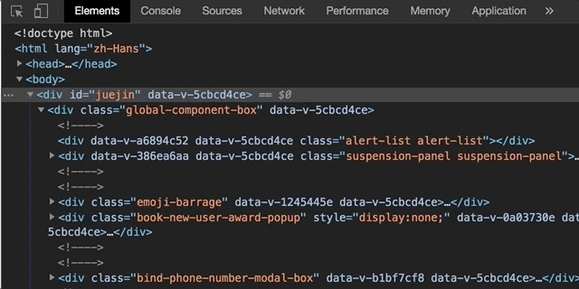

## 2. 访问最近的控制台结果

在控制台输入\$\_可以获控制台最近一次的输出结果。

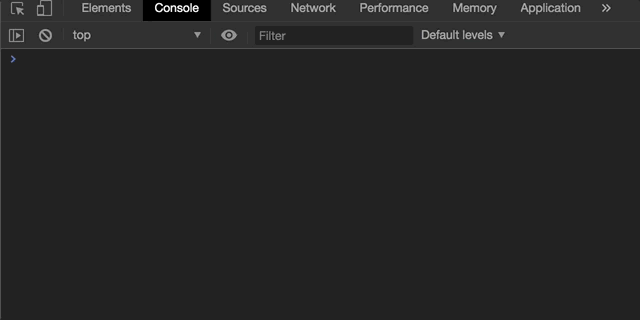

## 3. 访问最近选择的元素和对象

控制台会存储最近 5 个被选择的元素和对象。当你在元素面板选择一个元素或在分析器面板选择一个对象,记录都会存储在栈中。 可以使用$x来操作历史栈,x是从0开始计数的,所以$0 表示最近选择的元素,\$4 表示最后选择的元素。

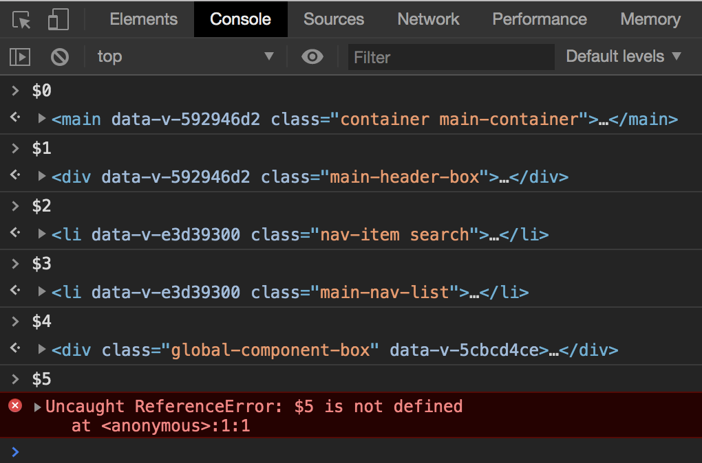

## 4. 选择元素

- \$() - 返回满足指定 CSS 规则的第一个元素，此方法为 document.querySelector()的简化。

- \$\$() - 返回满足指定 CSS 规则的所有元素，此方法为 querySelectorAll()的简化。

- \$x() - 返回满足指定 XPath 的所有元素。

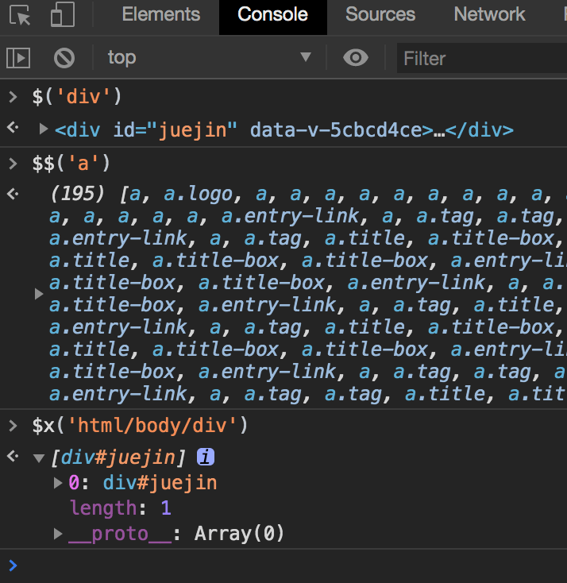

## 5. 使用 console.table

该命令支持以表格的形式输出日志信息。打印复杂信息时尝试使用 console.table 来替代 console.log 会更加清晰。

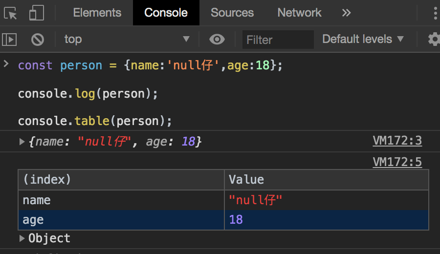

## 6. 使用 console.dir,可简写为 dir

console.dir(object)/dir(object) 命令可以列出参数 object 的所有对象属性。

## 7. 复制 copy

你可以通过 copy 方法在控制台里复制你想要的东西。

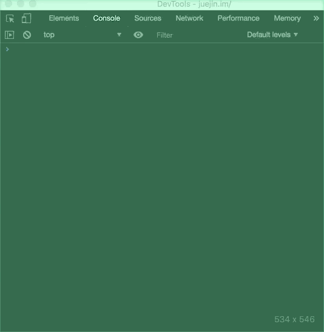

## 8. 获取对象键值 keys(object)/values(object)

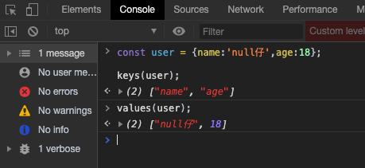

## 9. 函数监听器 monitor(function)/unmonitor(function)

monitor(function),当调用指定的函数时,会将一条消息记录到控制台,该消息指示调用时传递给该函数的函数名和参数。

使用 unmonitor(函数)停止对指定函数的监视。

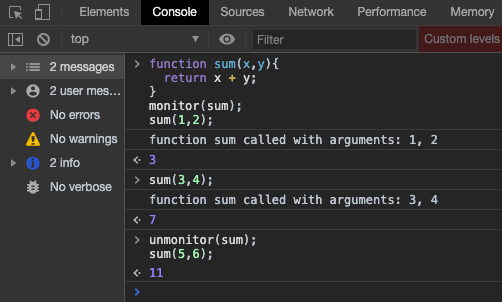

## 10. 事件监听器 monitorEvents(object[, events])/unmonitorEvents(object[, events])

monitorEvents(object[, events]),当指定的对象上发生指定的事件之一时,事件对象将被记录到控制台。事件类型可以指定为单个事件或事件数组。

unmonitorevent (object[， events])停止监视指定对象和事件的事件。

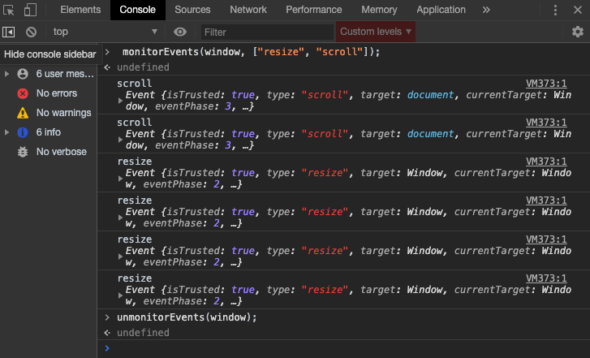

## 11. 耗时监控

通过调用 time()可以开启计时器。你必须传入一个字符串参数来唯一标记这个计时器的 ID。当你要结束计时的时候可以调用 timeEnd()，并且传入指定的名字。计时结束后控制台会打印计时器的名字和具体的时间。

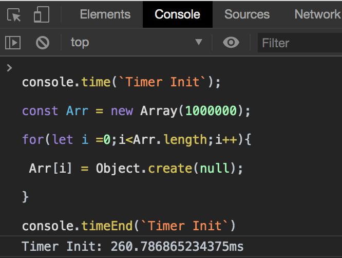

## 12. 分析程序性能

在 DevTools 窗口控制台中，调用 console.profile()开启一个 JavaScript CPU 分析器.结束分析器直接调用 console.profileEnd().

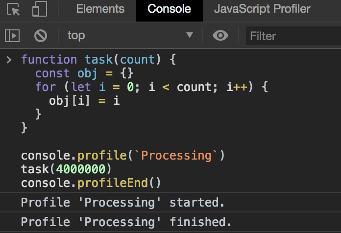

具体的性能分析会在分析器面板中

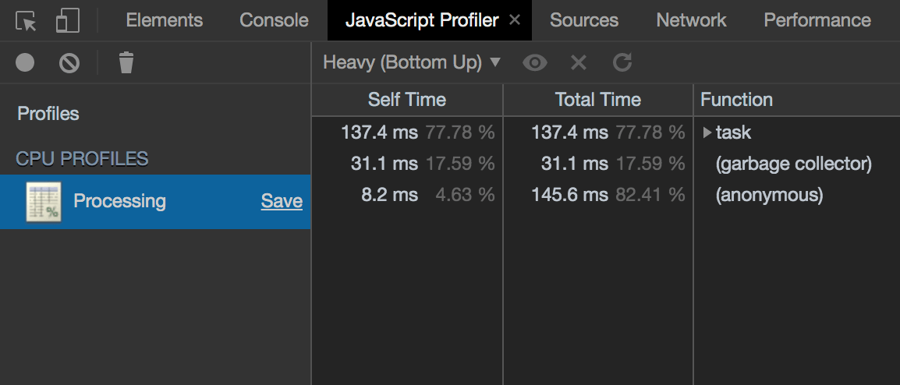

## 13. 统计表达式执行次数

count()方法用于统计表达式被执行的次数,它接受一个字符串参数用于标记不同的记号。如果两次传入相同的字符串,该方法就会累积计数。

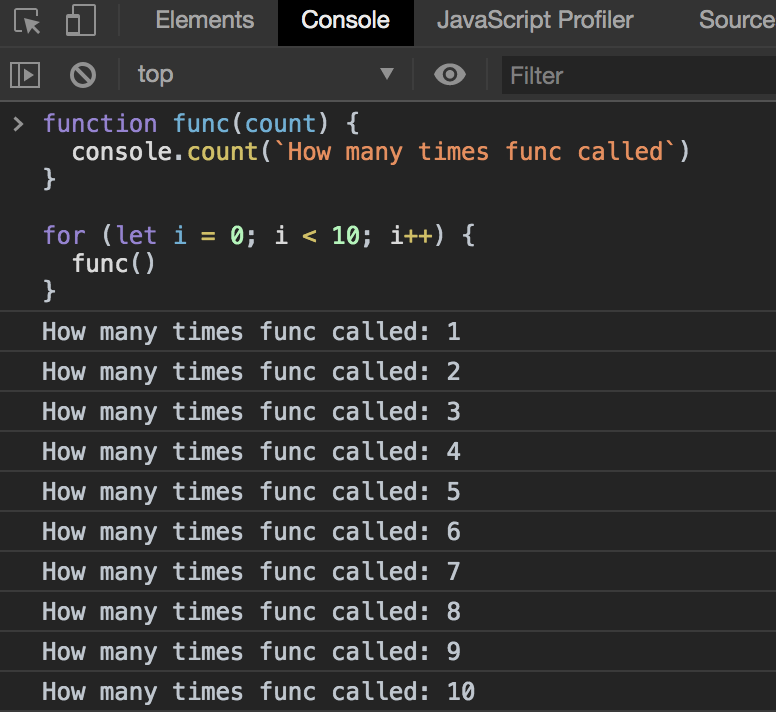

## 14. 清空控制台历史记录

可以通过下面的方式清空控制台历史:

- 在控制台右键，或者按下 Ctrl 并单击鼠标，选择 Clear Console。
- 在脚本窗口输入 clear()执行。
- 在 JavaScript 脚本中调用 console.clear()。
- 使用快捷键 Cmd + K (Mac) Ctrl + L (Windows and Linux)。

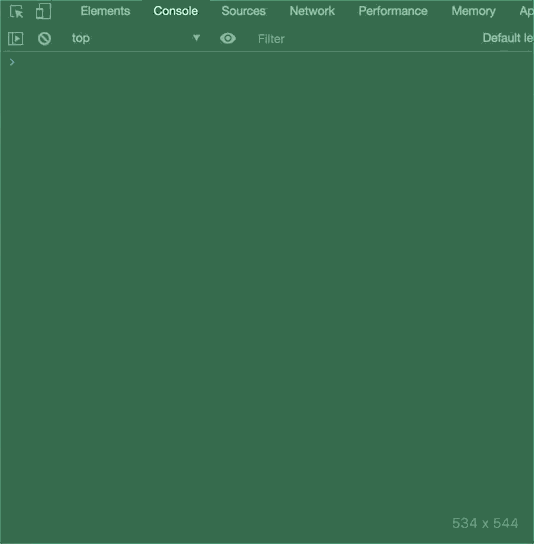

## 15. 异步操作

async/await 使得异步操作变得更加容易和可读。唯一的问题在于 await 需要在 async 函数中使用。Chrome DevTools 支持直接使用 await。

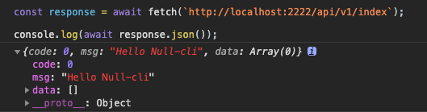

## 16. debugger 断点

有时候我们需要打断点进行单步调试,一般会选择在浏览器控制台直接打断点,但这样还需要先去 Sources 里面找到源码,然后再找到需要打断点的那行代码,比较麻烦。

使用 debugger 关键词,我们可以直接在源码中定义断点,方便很多。

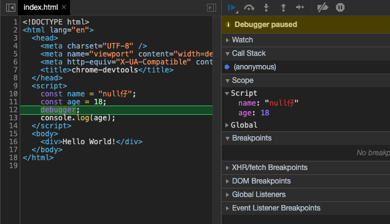

##  17. 截图

我们经常需要截图,Chrome DevTools 提供了 4 种截图方式,基本覆盖了我们的需求场景,快捷键 ctrl+shift+p ,打开 Command Menu,输入 screenshot,可以看到以下 4 个选项:

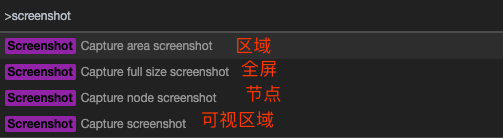

去试试吧,很香!

## 18. 切换主题

Chrome 提供了 亮&暗 两种主题,当你视觉疲劳的时候,可以 switch 哦, 快捷键 ctrl+shift+p ,打开 Command Menu,输入 theme ,即可选择切换

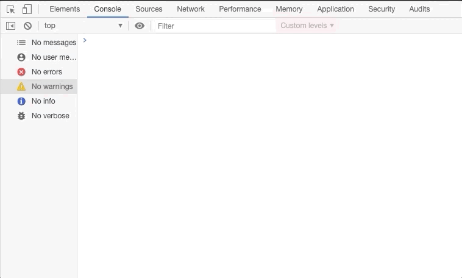

## 19. 复制 Fetch

在 Network 标签下的所有的请求,都可以复制为一个完整的 Fetch 请求的代码。

## 20. 重写 Overrides

在 Chrome DevTools 上调试 css 或 JavaScript 时,修改的属性值在重新刷新页面时,所有的修改都会被重置。

如果你想把修改的值保存下来,刷新页面的时候不会被重置,那就看看下面这个特性（Overrides）吧。Overrides 默认是关闭的,需要手动开启,开启的步骤如下。

开启的操作:

打开 Chrome DevTools 的 Sources 标签页
选择 Overrides 子标签
选择 + Select folder for overrides,来为 Overrides 设置一个保存重写属性的目录

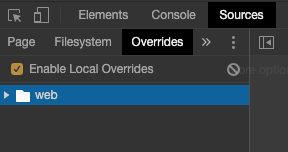

## 21. 实时表达式 Live Expression

从 chrome70 起,我们可以在控制台上方可以放一个动态表达式,用于实时监控它的值。Live Expression 的执行频率是 250 毫秒。

点击 "Create Live Expression" 眼睛图标,打开动态表达式界面,输入要监控的表达式

## 22. 检查动画

Chrome DevTools 动画检查器有两个主要用途。

- 检查动画。您希望慢速播放、重播或检查动画组的源代码。

- 修改动画。您希望修改动画组的时间、延迟、持续时间或关键帧偏移。 当前不支持编辑贝塞尔曲线和关键帧。

动画检查器支持 CSS 动画、CSS 过渡和网络动画。当前不支持 requestAnimationFrame 动画。

快捷键 ctrl+shift+p ,打开 Command Menu,键入 Drawer: Show Animations。

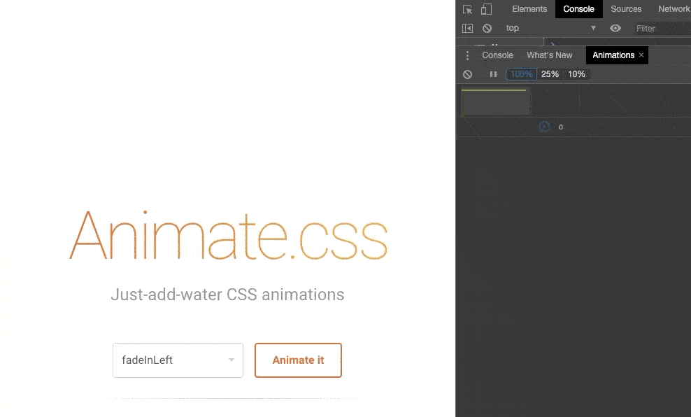

## 23. 滚动到视图区域 Scroll into view

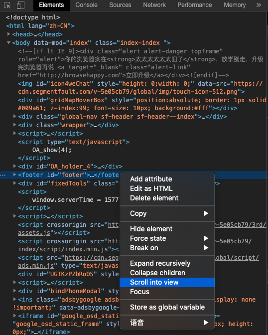

## 24. 工作区编辑文件 Edit Files With Workspaces

工作空间使您能够将在 Chrome Devtools 中进行的更改保存到计算机上相同文件的本地副本。

进入 Sources Menu, Filesystem 下 点击 Add folder to workspace 添加要同步的工作目录

# 快捷键

<!-- https://developers.google.com/web/tools/chrome-devtools -->

## 访问 DevTools

|             访问 DevTools             |        Windows        |       Mac       |
| :-----------------------------------: | :-------------------: | :-------------: |
| 打开 Developer Tools (上一次停靠菜单) | F12、Ctrl + Shift + I |  Cmd + Opt + I  |
|   打开/切换检查元素模式和浏览器窗口   |   Ctrl + Shift + C    | Cmd + Shift + C |
|  打开 Developer Tools 并聚焦到控制台  |   Ctrl + Shift + J    |  Cmd + Opt + J  |

## 全局键盘快捷键

下列键盘快捷键可以在所有 DevTools 面板中使用:

|           全局键盘快捷键           |           Windows           |       Mac        |
| :--------------------------------: | :-------------------------: | :--------------: |
|             下一个面板             |          Ctrl + ]           |     Cmd + ]      |
|             上一个面板             |          Ctrl + [           |     Cmd + [      |
|       更改 DevTools 停靠位置       |      Ctrl + Shift + D       | Cmd + Shift + D  |
|          打开 Device Mode          |      Ctrl + Shift + M       | Cmd + Shift + M  |
|             切换控制台             |             Esc             |       Esc        |
|              刷新页面              |        F5、Ctrl + R         |     Cmd + R      |
|       刷新忽略缓存内容的页面       | Ctrl + F5、Ctrl + Shift + R | Cmd + Shift + R  |
|     在当前文件或面板中搜索文本     |          Ctrl + F           |     Cmd + F      |
|         在所有源中搜索文本         |      Ctrl + Shift + F       |  Cmd + Opt + F   |
| 按文件名搜索（除了在 Timeline 上） |     Ctrl + O、Ctrl + P      | Cmd + O、Cmd + P |
|    放大（焦点在 DevTools 中时）    |          Ctrl + +           | Cmd + Shift + +  |
|                缩小                |          Ctrl + -           | Cmd + Shift + -  |
|          恢复默认文本大小          |          Ctrl + 0           |     Cmd + 0      |
|         打开 command 菜单          |      Ctrl + Shift + P       | Cmd + Shift + P  |

## 控制台

| 控制台快捷键  |    Windows    |      Mac      |
| :-----------: | :-----------: | :-----------: |
| 上一个命令/行 |    向上键     |    向上键     |
| 下一个命令/行 |    向下键     |    向下键     |
| 聚焦到控制台  |   Ctrl + \`   |   Ctrl + \`   |
|  清除控制台   |   Ctrl + L    |    Cmd + K    |
|   多行输入    | Shift + Enter | Shift + Enter |
|     执行      |     Enter     |    Return     |
