## 前言

> 一个前端好好切图不好吗?为什么要学 linux 呢? 嗯,真香 !


## 1. ls 命令 : 显示目录内容列表

Linux ls 命令用于显示指定工作目录下之内容（列出目前工作目录所含之文件及子目录)。

```shell
ls [-alrtAFR] [name...]
```

### 常用 options

- -a 显示所有文件及目录 (ls 内定将文件名或目录名称开头为"."的视为隐藏档，不会列出)
- -A 同 -a ,但不列出 "." (目前目录) 及 ".." (父目录)
- -R 若目录下有文件,则以下之文件亦皆依序列出

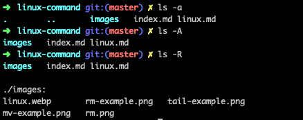

## 2. rm 命令 : 删除文件/目录

Linux rm 命令用于删除一个文件或者目录。

```shell
rm [options] [name...]
```

### options:

- -i 删除前逐一询问确认
- -r 或-R：递归处理，将指定目录下的所有文件与子目录一并处理
- -f：强制删除文件或目录

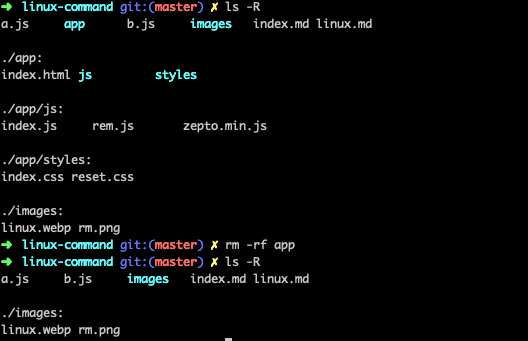


## 3. tail 命令 : 查看文件内容

tail 命令可用于查看文件的内容，有一个常用的参数 **-f** 常用于查阅正在改变的日志文件。

**tail -f filename** 会把 filename 文件里的最尾部的内容显示在屏幕上，并且不断刷新，只要 filename 更新就可以看到最新的文件内容。

```shell
tail [options][file]
```

### 常用 options:

- -f 循环读取


## 4. mv 命令 : 文件移动/改名

Linux mv 命令用来为文件或目录改名、或将文件或目录移入其它位置。

```shell
mv [options] source dest
# or
mv [options] source... directory
```

### options:

- -i: 若指定目录已有同名文件，则先询问是否覆盖旧文件
- -f: 在 mv 操作要覆盖某已有的目标文件时不给任何指示

|     命令格式     |                          运行结果                          |
| :--------------: | :--------------------------------------------------------: |
| mv 文件名 文件名 |                  将源文件名改为目标文件名                  |
| mv 文件名 目录名 |                    将文件移动到目标目录                    |
| mv 目录名 目录名 | 目标目录已存在,将源目录移动到目标目录.目标目录不存在则改名 |
| mv 目录名 文件名 |                            出错                            |

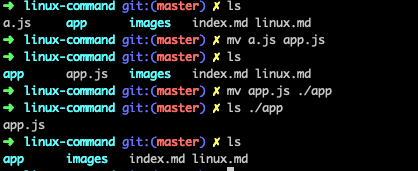

## 5. touch 命令 : 新建文件

Linux touch 命令用于修改文件或者目录的时间属性,包括存取时间和更改时间。若文件不存在,系统会建立一个新的文件。

ls -l 可以显示档案的时间记录。

```shell
touch [file]
```

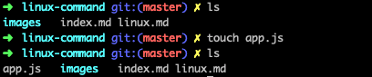

## 6. which 命令 : 查找文件

which 指令会在环境变量\$PATH 设置的目录里查找符合条件的文件。

```shell
which [file...]
```

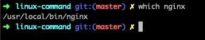

## 7. cp 命令 : 复制文件/目录

Linux cp 命令主要用于复制文件或目录。

```shell
cp [options] source dest
# or
cp [options] source... directory
```

### 常用 options:

- -f：覆盖已经存在的目标文件而不给出提示。
- -r：若给出的源文件是一个目录文件,此时将复制该目录下所有的子目录和文件。

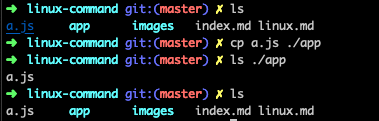

## 8. cd 命令 : 切换工作目录

Linux cd 命令用于切换当前工作目录至 dirName(目录参数)。

其中 dirName 表示法可为绝对路径或相对路径。若目录名称省略，则变换至使用者的 home 目录,"~" 也表示为 home 目录 的意思

```shell
cd [dirName]
```

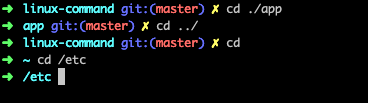

## 9. pwd 命令 : 显示工作目录

Linux pwd 命令用于显示工作目录。

执行 pwd 指令可立刻得知您目前所在的工作目录的绝对路径名称。

```shell
pwd
```

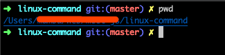

## 10. mkdir 命令 : 创建目录

Linux mkdir 命令用于建立名称为 dirName 之子目录。

```shell
mkdir [-p] dirName
```

### options

- -p 确保目录名称存在,不存在的就建一个。

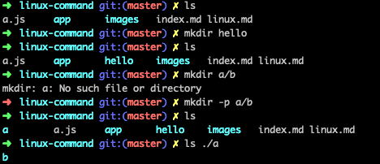

## 11. rmdir 命令 : 删除空目录

Linux rmdir 命令删除空的目录。

```shell
rmdir [-p] dirName
```

### options

- -p 是当子目录被删除后使它也成为空目录的话,则顺便一并删除。

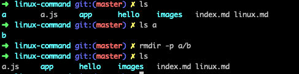

## 12. cat 命令 : 查看文件内容

cat 命令用于连接文件并打印到标准输出设备上。

```shell
cat fileName
```

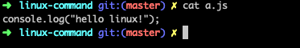

## 13. ping 命令 : 检测主机

执行 ping 指令会使用 ICMP 传输协议,发出要求回应的信息,若远端主机的网络功能没有问题,就会回应该信息,因而得知该主机运作正常。

```shell
ping  [主机名称或IP地址]
```

### 常用 options:

- -c<完成次数> 设置完成要求回应的次数。

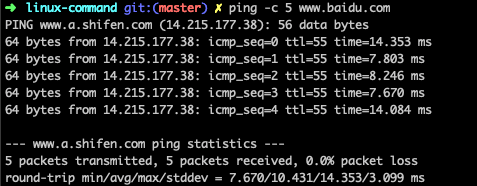

## 14. telnet 命令 : 端口是否可访问

虽然 Linux telnet 命令主要用于远端登入。执行 telnet 指令开启终端机阶段作业,并登入远端主机,

但是我更经常用它来查看某个远端主机端口是否可访问。

```shell
telnet [主机名称或IP地址<通信端口>]
```

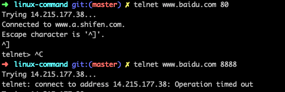

## 15. grep 命令 : 查找关键字

Linux grep 命令用于查找文件里符合条件的字符串。

```shell
grep [文件或目录...]
```

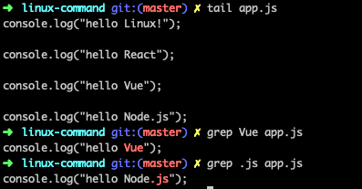

## 16. ps 命令 : 显示当前进程状态

Linux ps 命令用于显示当前进程 (process) 的状态。

```shell
ps [options]
```

### 常用 options

- -e 显示所有进程。
- -f 全格式。

```shell
ps -ef # 显示所有命令，连带命令行
```

## 17. | 命令 : 管道命令

通常情况下,我们只执行一条命令,那么如何执行多条命令呢？

> 管道是一种通信机制，通常用于进程间的通信（也可通过 socket 进行网络通信），它表现出来的形式将前面每一个进程的输出（stdout）直接作为下一个进程的输入（stdin）。

- 只能处理前一条指令的正确输出，不能处理错误输出
- 管道命令必须要能够接受来自前一个命令的数据成为 standard input 继续处理才行。

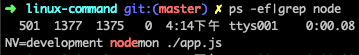

## 18. kill 命令 : 杀死进程

Linux kill 命令用于删除执行中的程序或工作。

kill 可将指定的信息送至程序。预设的信息为 SIGTERM(15),可将指定程序终止。若仍无法终止该程序,可使用 SIGKILL(9)信息尝试强制删除程序。程序或工作的编号可利用 ps 指令或 jobs 指令查看。

```shell
kill [-s <信息名称或编号>][程序]　或　kill [-l <信息编号>]
```

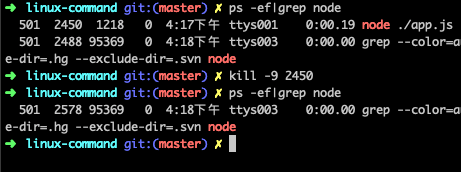

## 19. top 命令 : 实时显示进程动态

Linux top 命令用于实时显示 process 的动态。

```shell
top
```

### 常用 options:

- -pid 指定进程 id

```shell
top -pid 4712
```

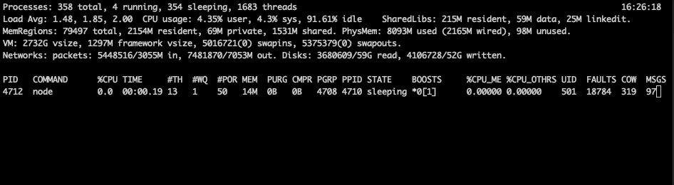

## 20. clear 命令 : 清除屏幕

Linux clear 命令用于清除屏幕。

```shell
clear
```

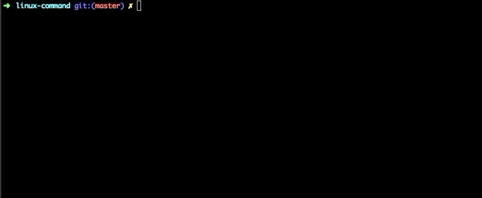

## 21. alias 命令 : 别名配置

Linux alias 命令用于设置指令的别名。

用户可利用 alias,自定指令的别名。若仅输入 alias,则可列出目前所有的别名设置。alias 的效力仅及于该次登入的操作。若要每次登入是即自动设好别名,可在.profile 或.cshrc 中设定指令的别名。

```shell
alias[别名]=[指令名称]
```

比如 git 原先就配置了一些别名,我们来看看

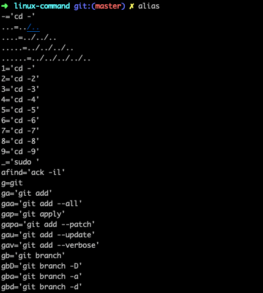

## 22. find 命令 : 查找文件

Linux find 命令用来在指定目录下查找文件。任何位于参数之前的字符串都将被视为欲查找的目录名。

如果使用该命令时,不设置任何参数,则 find 命令将在当前目录下查找子目录与文件。并且将查找到的子目录和文件全部进行显示。

```shell
find   path   -option   [   -print ]   [ -exec   -ok   command ]   {} \;
```

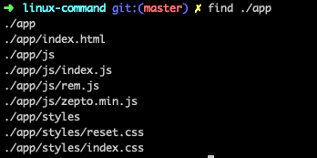

## 23. curl 命令 : 文件传输

linux curl 是通过 url 语法在命令行下上传或下载文件的工具软件,它支持 http,https,ftp,ftps,telnet 等多种协议,常被用来抓取网页和监控 Web 服务器状态。

```shell
curl [options] [url]
```

### 常用 options:

- -o 把输出写到该文件中

- -I 仅仅返回 header

curl 命令能做很多事,用过的人都说香,我说说我常用的场景吧:

1. 调试请求

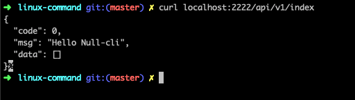

2. 查看头部信息

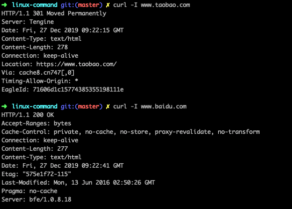

3. 抓取网页

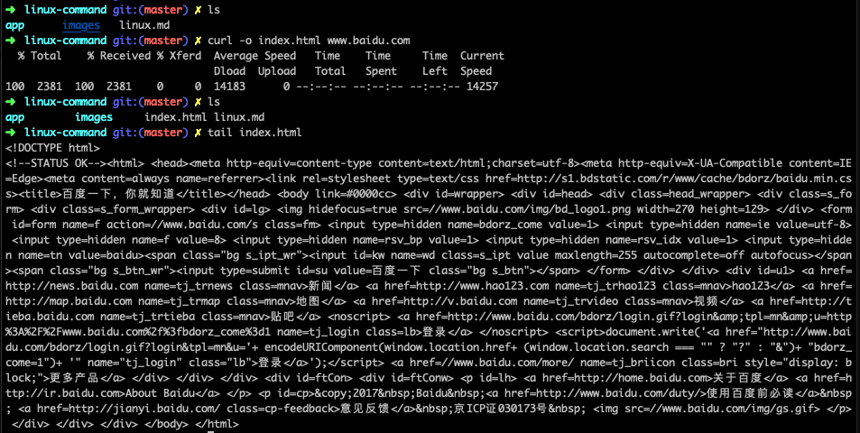

## 后记

> 如果你和我一样喜欢前端,也爱动手折腾,欢迎关注我一起玩耍啊～ ❤️

### 博客

[我的博客](https://github.com/webfansplz/article)

### 公众号

前端时刻


