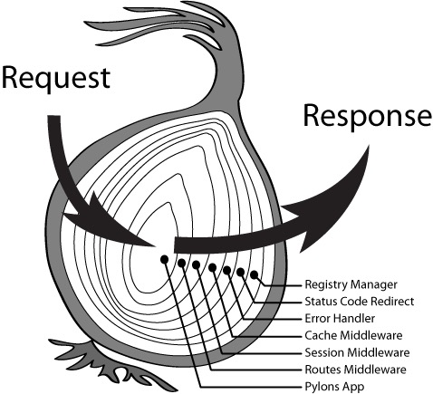

## koa-洋葱模型

**koa 最大的特点就是独特的中间件流程控制,也就是大名鼎鼎的“洋葱模型”。没图说个???**



我们可以很清晰的看到 一个请求从外到里一层一层的经过中间件,响应时从里到外一层一层的经过中间件。

就像我们往洋葱插入一根牙签,牙签从外到里经过一层层洋葱皮,到达"葱心",我们拔出来时,牙签从里到外经过一层一层洋葱皮。(我怀疑你在开车,但是...)

**Talk is cheap,Show me the code。简单说就是,没代码说个???**

下面,我们来分析一波 koa-compose 源码

```javascript
/**
 * Compose `middleware` returning
 * a fully valid middleware comprised
 * of all those which are passed.
 *
 * @param {Array} middleware
 * @return {Function}
 * @api public
 */

function compose(middleware) {
  if (!Array.isArray(middleware)) throw new TypeError('Middleware stack must be an array!');
  for (const fn of middleware) {
    if (typeof fn !== 'function') throw new TypeError('Middleware must be composed of functions!');
  }

  /**
   * @param {Object} context
   * @return {Promise}
   * @api public
   */

  return function(context, next) {
    // last called middleware #
    let index = -1;
    return dispatch(0);
    function dispatch(i) {
      if (i <= index) return Promise.reject(new Error('next() called multiple times'));
      index = i;
      let fn = middleware[i];
      if (i === middleware.length) fn = next;
      if (!fn) return Promise.resolve();
      try {
        return Promise.resolve(fn(context, dispatch.bind(null, i + 1)));
      } catch (err) {
        return Promise.reject(err);
      }
    }
  };
}
```

我们可以看到除去类型错误判断,代码只有短短的 10 多行...下面我们分析一哈核心代码～

```javascript
function compose(middleware) {
  // 返回了一个函数,接受context和next参数,koa在调用koa-compose时只传入context,所以此处next即为undefined;
  return function(context, next) {
    // last called middleware #
    //  初始化index
    let index = -1;
    //  从第一个中间件开始执行～
    return dispatch(0);
    //  执行函数
    function dispatch(i) {
      //  在一个中间件执行两次next函数时,抛出异常.  注解: ⭕
      if (i <= index) return Promise.reject(new Error('next() called multiple times'));
      //  设置index,作用是判断在同一个中间件中是否调用多次next函数.
      index = i;
      //  当前中间件函数
      let fn = middleware[i];
      //  跑完所有中间件时,fn = next ,即fn = undefined,可以理解为终止条件;
      if (i === middleware.length) fn = next;
      //  返回一个空值的promise对象.  注解: ⭕⭕
      if (!fn) return Promise.resolve();
      try {
        //  返回一个定值的promise对象.值为下一个中间件的返回值。
        //  这里是最核心的逻辑,递归调用下一个中间件,并将返回值返回给上一个中间件。 注解:  ⭕⭕
        return Promise.resolve(fn(context, dispatch.bind(null, i + 1)));
      } catch (err) {
        return Promise.reject(err);
      }
    }
  };
}
```

如果看完上面的分析,你还觉得一脸萌比的话,没关系,下面我们来通过实践再来理解一波.

**1.我们首先验证一哈我们上面说的高大上的洋葱模型.**

```javascript
const m1 = async (context, next) => {
  console.log('in-1');
  await next();
  console.log('out-1');
};
const m2 = async (context, next) => {
  console.log('in-2');
  await next();
  console.log('out-2');
};
const m3 = async (context, next) => {
  console.log('in-3');
  await next();
  console.log('out-3');
};
compose([m1, m2, m3])();

//output
// in-1
// in-2
// in-3
// out-3
// out-2
// out-1
```

没毛病,一层一层往里进,一层一层往里出. 如果以上代码的执行结果让你感到意外和困惑..你或许该补一下 call stack 的知识了,看看[这个](https://www.jianshu.com/p/a6d37c77e8db),你就豁然开朗了.

**2.我们验证一哈注解 ⭕️.**

```javascript
const m1 = async (context, next) => {
  await next();
  await next();
};
compose([m1])();
// output
// UnhandledPromiseRejectionWarning: Error: next() called multiple times

☑️,验证通过
```

**2.最后我们来验证一哈注解 ⭕️⭕️.**

```javascript
const m1 = async (context, next) => {
  const res = await next();
  console.log('m1收到的返回结果:', res);
};
const m2 = async (context, next) => {
  const res = await next();
  console.log('m2收到的返回结果:', res);
  return '我是m2,这是我返回的结果.';
};
const m3 = async (context, next) => {
  const res = await next();
  console.log('m3收到的返回结果:', res);
  return '我是m3,这是我返回的结果.';
};
compose([m1, m2, m3])();
//output
// m3收到的返回结果: undefined
// m2收到的返回结果: 我是m3,这是我返回的结果.
// m1收到的返回结果: 我是m2,这是我返回的结果.
☑️,验证通过
```

[demo 代码](./compose.js)
