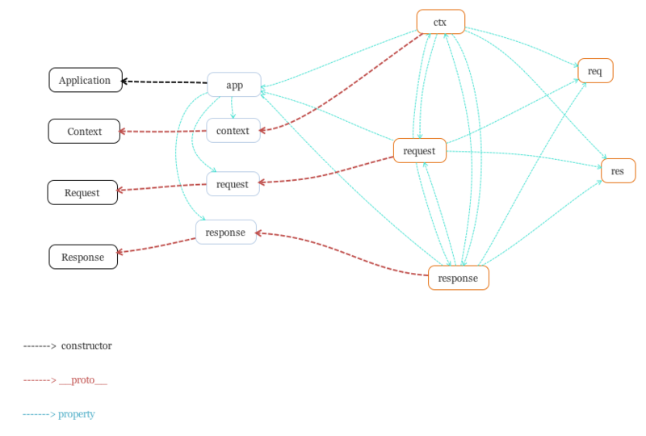

了解了 Koa 的一些核心实现思想,我们最后来分析源码就会发现清晰很多,GO ～

```javascript
'use strict';

/**
 * Module dependencies.
 */

const isGeneratorFunction = require('is-generator-function');
const response = require('./response');
const compose = require('koa-compose');
const isJSON = require('koa-is-json');
const context = require('./context');
const request = require('./request');
const statuses = require('statuses');
const Emitter = require('events');
const util = require('util');
const Stream = require('stream');
const http = require('http');
const convert = require('koa-convert');
const deprecate = require('depd')('koa');

module.exports = class Application extends Emitter {
  constructor() {
    super();
    this.proxy = false;
    this.subdomainOffset = 2;
    this.env = process.env.NODE_ENV || 'development';
    //  装载中间件容器
    this.middleware = [];
    //  创建context对象
    this.context = Object.create(context);
    //  创建request对象
    this.request = Object.create(request);
    //  创建response对象
    this.response = Object.create(response);

    if (util.inspect.custom) {
      this[util.inspect.custom] = this.inspect;
    }
  }
  //  创建http服务
  listen(...args) {
    const server = http.createServer(this.callback());
    return server.listen(...args);
  }
  toJSON() {
    return only(this, ['subdomainOffset', 'proxy', 'env']);
  }
  inspect() {
    return this.toJSON();
  }
  // use中间件
  use(fn) {
    if (typeof fn !== 'function') throw new TypeError('middleware must be a function!');
    if (isGeneratorFunction(fn)) {
      deprecate(
        'Support for generators will be removed in v3. ' +
          'See the documentation for examples of how to convert old middleware ' +
          'https://github.com/koajs/koa/blob/master/docs/migration.md'
      );
      fn = convert(fn);
    }
    this.middleware.push(fn);
    return this;
  }

  callback() {
    //  前面我们提到的"洋葱模型",中间件流程控制
    const fn = compose(this.middleware);
    /*  
      events模块的listenerCount方法,
      判断error事件的监听数量为0时,监听error事件。
    */
    if (!this.listenerCount('error')) this.on('error', this.onerror);

    const handleRequest = (req, res) => {
      //  创建上下文对象,传入http模块的req(请求对象),res(响应对象)
      const ctx = this.createContext(req, res);
      //  请求处理
      return this.handleRequest(ctx, fn);
    };

    return handleRequest;
  }
  handleRequest(ctx, fnMiddleware) {
    const res = ctx.res;
    res.statusCode = 404;
    /*  
      调用context.js的onerror函数
      context.js的onerror函数里,有这样一句代码 this.app.emit('error', err, this);
      其实就是我们之前提到的Eventemitter,所以这里会触发this.onerror方法.
      所以这里虽然调用的是context.js的onerror函数,但会触发两个error函数进行异常处理.
    */
    const onerror = err => ctx.onerror(err);
    //  对响应内容进行处理
    const handleResponse = () => respond(ctx);
    //  确保一个流在完成,关闭,报错时都会执行响应的回调函数
    onFinished(res, onerror);
    //  执行中间件,并处理对应响应
    return fnMiddleware(ctx)
      .then(handleResponse)
      .catch(onerror);
  }
  //  创建上下文对象, 看完如果觉得萌比的话,可看下方流程图
  createContext(req, res) {
    const context = Object.create(this.context);
    const request = (context.request = Object.create(this.request));
    const response = (context.response = Object.create(this.response));
    context.app = request.app = response.app = this;
    context.req = request.req = response.req = req;
    context.res = request.res = response.res = res;
    request.ctx = response.ctx = context;
    request.response = response;
    response.request = request;
    context.originalUrl = request.originalUrl = req.url;
    context.state = {};
    return context;
  }
  //  错误处理
  onerror(err) {
    // 判断 err 是否是 Error 实例
    if (!(err instanceof Error)) throw new TypeError(util.format('non-error thrown: %j', err));
    // 是否 404 错误
    if (404 == err.status || err.expose) return;
    // 是否有静默设置,
    if (this.silent) return;
    // 打印出出错堆栈,方便对问题进行定位
    const msg = err.stack || err.toString();
    console.error();
    console.error(msg.replace(/^/gm, '  '));
    console.error();
  }
};
//  响应内容处理
function respond(ctx) {
  // allow bypassing koa
  if (false === ctx.respond) return;
  //  是否为可写流
  if (!ctx.writable) return;

  const res = ctx.res;
  let body = ctx.body;
  const code = ctx.status;
  //  如果响应的Status Code是body 为空的类型,将 body 置为 null并响应
  // ignore body
  if (statuses.empty[code]) {
    // strip headers
    ctx.body = null;
    return res.end();
  }
  //  如果是HEAD方法
  if ('HEAD' == ctx.method) {
    //  http 响应头部是否已经被发送且body是否为json,未发送的话,添加 length 头部
    if (!res.headersSent && isJSON(body)) {
      ctx.length = Buffer.byteLength(JSON.stringify(body));
    }
    return res.end();
  }

  // status body
  // body值为空
  if (null == body) {
    // HTTP 版本>=2
    if (ctx.req.httpVersionMajor >= 2) {
      //  body值为code
      body = String(code);
    } else {
      //  body值为   context 中的 message 属性或 code
      body = ctx.message || String(code);
    }
    //  未发送响应头部,添加length和type
    if (!res.headersSent) {
      ctx.type = 'text';
      ctx.length = Buffer.byteLength(body);
    }
    return res.end(body);
  }

  //  responses
  //  处理buffer类型的body
  if (Buffer.isBuffer(body)) return res.end(body);
  //  处理字符串类型的body
  if ('string' == typeof body) return res.end(body);
  //  body是流类型,合并处理
  if (body instanceof Stream) return body.pipe(res);

  // body: json
  // body是json类型,序列化
  body = JSON.stringify(body);
  //  未发送响应头部,添加length
  if (!res.headersSent) {
    ctx.length = Buffer.byteLength(body);
  }
  res.end(body);
}
```

[代码地址](./end.js)

下面,引用某位大佬整理的流程图, 希望可以帮助你更清晰的理解 Koa 上下文对象～



## 结语

欢乐的时光总是这么短暂,到了跟大家说再见的时候啦,如果你觉得有帮助到你的话,请给我[小星星](https://github.com/webfansplz/article)~
