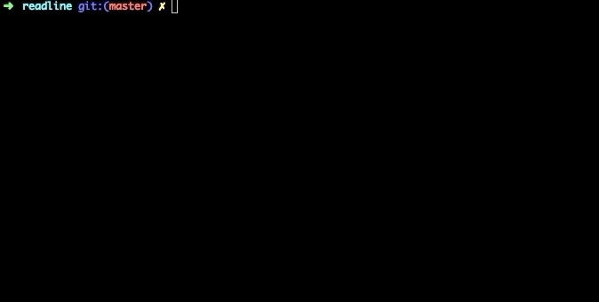

## 逐行读取 readline 模块

readline 模块是一个流内容的逐行读取模块，通过 require('readline')引用模块。你可以用 readline 模块来读取 stdin，可以用来逐行读取文件流，也可用它来在控制台和用户进行一些交互。

```js
const readline = require("readline");

const rl = readline.createInterface({
  //  监听的可读流
  input: process.stdin,
  //  逐行读取（Readline）数据要写入的可写流
  output: process.stdout
});

rl.question("你如何看待 null-cli ？", answer => {
  console.log(`感谢您的宝贵意见：${answer}`);
  rl.close();
});
```



很多有趣的 CLI 工具是基于 readline 造的哦,有兴趣的同学也可以尝试~
