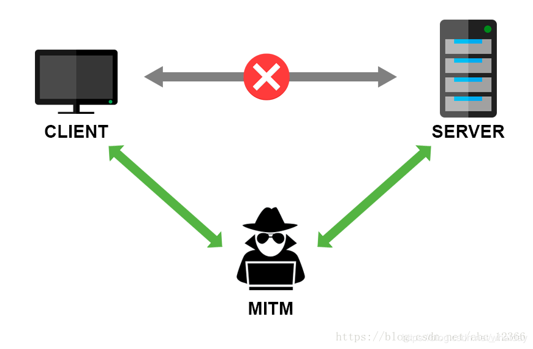

## what's MITM

> 中间人攻击（英语：Man-in-the-middle attack，缩写：MITM）在密码学和计算机安全领域中是指攻击者与通讯的两端分别创建独立的联系，并交换其所收到的数据，使通讯的两端认为他们正在通过一个私密的连接与对方直接对话，但事实上整个会话都被攻击者完全控制。在中间人攻击中，攻击者可以拦截通讯双方的通话并插入新的内容。在许多情况下这是很简单的（例如，在一个未加密的 Wi-Fi 无线接入点的接受范围内的中间人攻击者，可以将自己作为一个中间人插入这个网络）。

## Defending Against Man-in-the-Middle Attacks

### 1. Address Resolution Protocol (ARP) Cache Poisoning (ARP 缓存污染)

The Address Resolution Protocol (ARP) is a communications protocol used to resolve network addresses (such as IPV4 and IPV6) and physical ones (such as a MAC address) via the data link layer. A host will need to send an ARP request to the TCP/IP network to obtain a physical address. However, due to the unsecure nature of the ARP, it is vulnerable to MiTM attacks using a technique called ARP Spoofing.

The ARP lacks an authentication protocol, allowing an attacker to send spoofed or fake ARP messages to the Local Area Network (LAN). The objective of these attacks is to essentially map the attacking MAC address to the IP address of the target host, resulting in the interception of all traffic meant for the target host. The attacker can use the intercepted data for malicious purposes, such as spying or even modifying the communication between the parties involved

> 地址解析协议(ARP)是一种通信协议，用于通过数据链路层（Data Link Layer）解析网络地址(如 IPV4 和 IPV6)和物理地址(如 MAC 地址)。主机需要向 TCP/IP 网络发送 ARP 请求，以获得物理地址。然而，由于 ARP 的不安全性，它很容易受到 MiTM 攻击，这种攻击使用一种称为 ARP 欺骗的技术。ARP 缺乏认证协议，允许攻击者向局域网(LAN)发送欺骗或伪造的 ARP 消息。这些攻击的目标本质上是将攻击的 MAC 地址映射到目标主机的 IP 地址，从而拦截目标主机的所有流量。攻击者可以将截获的数据用于恶意目的，例如监视甚至修改相关方之间的通信。

Mitigation:

- Adding static ARP entries into the cache is one method of mitigating ARP cache poisoning attacks. This method prevents attackers from using ARP requests and replies as the devices in the network will rely on the local cache instead. However, this technique might not be feasible for larger organizations, as each system in the network will need be configured manually.

As an alternative, IT professionals can look into software that comes with anti-ARP spoofing solutions that can monitor and stop all endpoint processes that send suspicious ARP traffic.For regular users, always visiting websites using the HTTPS protocol will prevent attackers from intercepting data.

> 向缓存中添加静态 ARP 条目是防止 ARP 缓存污染的一种方法,这种方法可以防止攻击者使用 ARP 请求和应答,因为网络中的设备将依赖于本地缓存。但是，这种技术可能不适用于较大的企业机构，因为网络中的每个系统都需要手动配置。作为替代方案，IT 专业人员可以查看带有反 ARP 欺骗解决方案的软件，这些软件可以监视和停止所有发送可疑 ARP 流量的程序,对于普通用户,务必使用 HTTPS 协议访问网站来防止攻击者拦截数据。

- [如何防御 ARP 攻击 - from 知乎 陈鑫杰](https://www.zhihu.com/question/23401171/answer/222083588)

### 2. SSL (Secure Socket Layer) and TLS (Transport Layer Security) Hijacking (SSL 和 TLS 挾持)

SSL and TLS protocols use web encryption to provide secure network communication. The most common type of SSL protocol, and the one most often encountered by regular users, is HTTPS. This protocol consists of communication over the traditional Hypertext Transfer Protocol (HTTP), but is protected via encryption through SSL and TLS. While these protocols provide greater protection for network communication, they can still be vulnerable to MiTM attacks. Many users often do not use “https” when trying to access a website, as they will first connect to the unsecured HTTP site before being redirected to the HTTPS site. An attacker can compromise this step via connection hijacking attacks, which can be pulled off by using tools such as sslstrip, which strips the website of its SSL protocols

> SSL 和 TLS 协议使用 web 加密来提供安全的网络通信。最常见的 SSL 协议类型是 HTTPS，也是普通用户最常遇到的一种。该协议由传统超文本传输协议(HTTP)上的通信组成，但通过 SSL 和 TLS 进行加密保护。虽然这些协议为网络通信提供了更大的保护，但它们仍然容易受到 MiTM 攻击。许多用户在尝试访问网站时通常不使用“https”，因为他们在被重定向到 https 网站之前，首先会连接到不安全的 HTTP 站点。攻击者可以通过连接劫持攻击来破坏这一步骤，通过使用 sslstrip 等工具可以实现这一目的，sslstrip 可以去掉网站的 SSL 协议

Mitigation:

- The HTTP Strict Transport Security (HSTS) is a security mechanism sent through special response headers that can protect against MiTM attacks by only allowing websites to be accessed through TLS or SSL. This cuts out the vulnerable portion of website access by bypassing connection via HTTP. IT Professionals should look into implementing HSTS as a standard part of their security policies, as it greatly enhances website security, preventing MiTM incidents for both the organization and their website visitors.

For regular users, always verify if a website is secure by checking the URL bar for a (green) lock icon before typing any sensitive data like password. A (green) lock icon means the traffic to the website is encrypted with a legitimate certificate.

> HTTP 严格传输安全(HSTS)是一种通过特殊响应标头发送的安全机制，它只允许通过 TLS 或 SSL 访问网站，从而防止 MiTM 攻击。这将通过绕过 HTTP 的连接来切断网站访问的脆弱部分。IT 专业人员应该考虑将 HSTS 实现为其安全策略的标准部分，因为它极大地增强了网站安全性，为组织及其网站访问者防止了 MiTM 事件。对于普通用户，在输入任何敏感数据(如密码)之前，一定要检查 URL 栏中的(绿色)锁图标，以确认网站是否安全。(绿色)锁图标表示网站的流量是用合法的证书加密的。

- [浅谈流量劫持与防治-from 知乎 神机算子](https://zhuanlan.zhihu.com/p/40682772)

### 3. Domain Name Server (DNS) Spoofing (DNS 欺骗)

Spoofing is another common type of attack, and refers to an attacker impersonating the victim’s identity to trick the network into the believing the legitimacy of the attacker’s profile. Cyber criminals often use spoofing tactics to infiltrate networks, allowing them access to restricted data and information.

Spoofing can take many different forms. Domain Name Server (DNS) spoofing is commonly used in Man in the Middle Attacks. A DNS spoofing attack happens when an attacker uses weaknesses in the DNS software, often by injecting a “poisoned” DNS entry into the DNS server’s cache. This causes it to return an incorrect IP address, which is often a compromised website used by the attacker for different purposes such as phishing attacks. DNS spoofing can be difficult to detect, as cybercriminals will often create malicious websites that resemble legitimate ones.

> 欺骗是另一种常见的攻击类型，它指的是攻击者模仿受害者的身份欺骗网络，使其相信攻击者的个人资料是合法的。网络犯罪分子经常使用欺骗手段渗透网络，让他们访问受限制的数据和信息。欺骗可以采取许多不同的形式。域名服务器(DNS)欺骗是中间人攻击中常用的手段。当攻击者利用 DNS 软件中的弱点时，DNS 欺骗攻击就会发生，通常是通过向 DNS 服务器的缓存中注入“中毒”的 DNS 条目。这将导致它返回一个错误的 IP 地址，这通常是一个被攻击者用于不同目的(如钓鱼攻击)的受危害的网站。DNS 欺骗很难被发现，因为网络罪犯经常会创建类似合法网站的恶意网站。

Mitigation:

DNS spoofing can be difficult to detect for users who are unaware of this type of attack. IT professionals can help protect their network's users by regularly clearing the DNS cache of local machines and network servers. In addition, users of Microsoft-based systems can look into utilizing Domain Name Security System Extensions (DNSSEC), which are a suite of extensions that tighten DNS security by providing features such as origin authority, data integrity, and authenticated denial of existence. DNSSEC is particularly effective against DNS spoofing attacks.

> 对于不知道这种攻击类型的用户来说，很难检测到 DNS 欺骗。IT 专业人员可以通过定期清除本地机器和网络服务器的 DNS 缓存来帮助保护他们的网络用户。此外，基于 microsoft 的系统的用户可以考虑利用域名安全系统扩展(DNSSEC)，这是一套扩展，通过提供诸如源权限、数据完整性和身份验证拒绝存在等特性来加强 DNS 安全性。DNSSEC 对于 DNS 欺骗攻击特别有效。

### 4. SessionHijack (会话劫持)

The Session Hijacking attack consists of the exploitation of the web session control mechanism, which is normally managed for a session token.

Because http communication uses many different TCP connections, the web server needs a method to recognize every user’s connections. The most useful method depends on a token that the Web Server sends to the client browser after a successful client authentication. A session token is normally composed of a string of variable width and it could be used in different ways, like in the URL, in the header of the http requisition as a cookie, in other parts of the header of the http request, or yet in the body of the http requisition.

The Session Hijacking attack compromises the session token by stealing or predicting a valid session token to gain unauthorized access to the Web Server.

> 会话劫持攻击包括对 web 会话控制机制的利用，该机制通常针对会话令牌进行管理。因为 http 通信使用许多不同的 TCP 连接，所以 web 服务器需要一种方法来识别每个用户的连接。最有用的方法依赖于 Web 服务器在成功的客户端身份验证之后发送给客户端浏览器的令牌。会话令牌通常由一个字符串变量组成,它可以以不同的方式使用,像在 URL 中,http 请求头的 cookie,http 请求头的其他部分,或在 http 请求的主体。会话劫持攻击通过窃取或预测有效的会话令牌来对 Web 服务器进行未经授权的访问，从而损害会话令牌。

## 简单实践

[http-MITM](./code/MITM/http-proxy/index.js)

[https-MITM](./code/MITM/https-proxy/index.js)

## 参考

[infosec-guide-defending-MITM](https://www.trendmicro.com/vinfo/us/security/news/cybercrime-and-digital-threats/infosec-guide-defending-against-man-in-the-middle-attacks)

[基于 Node.js 的 HTTPS MITM(中间人)代理的原理和实现](https://github.com/wuchangming/https-mitm-proxy-handbook)
