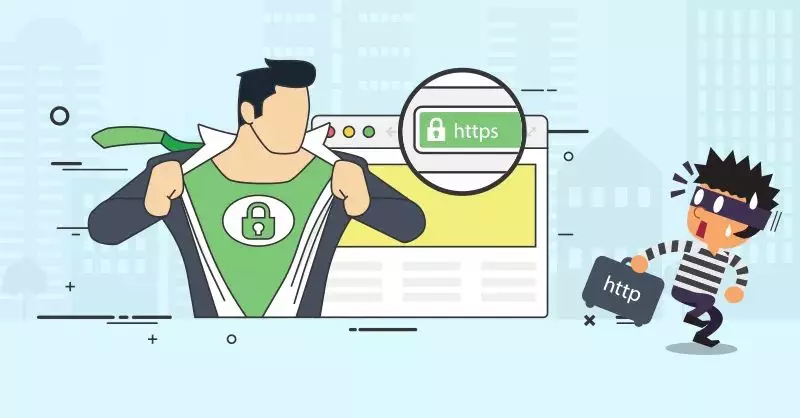
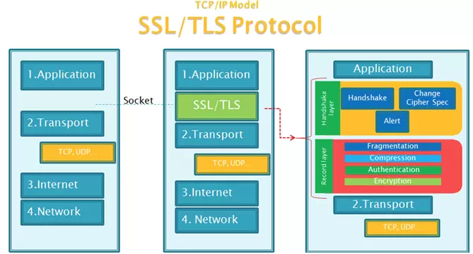
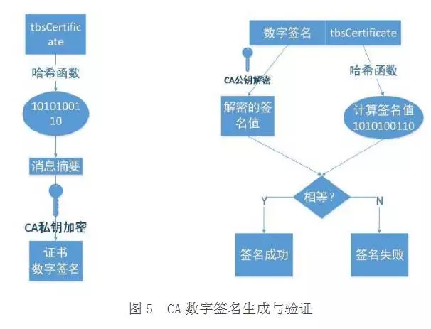
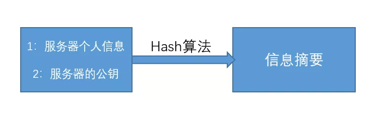
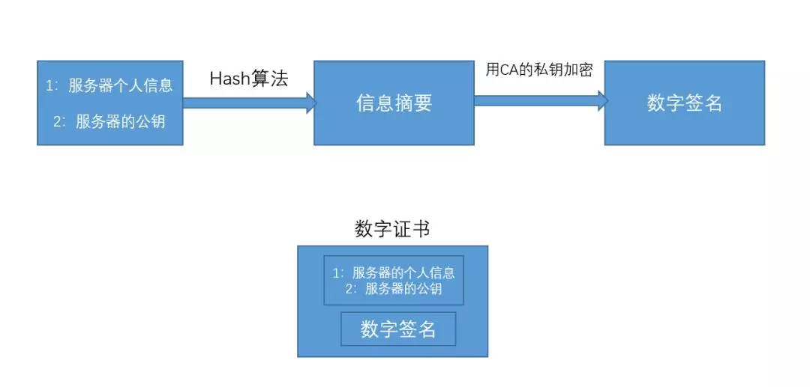
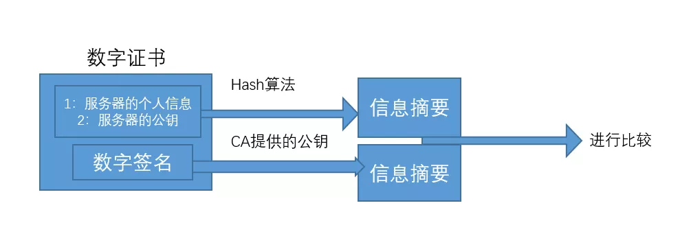
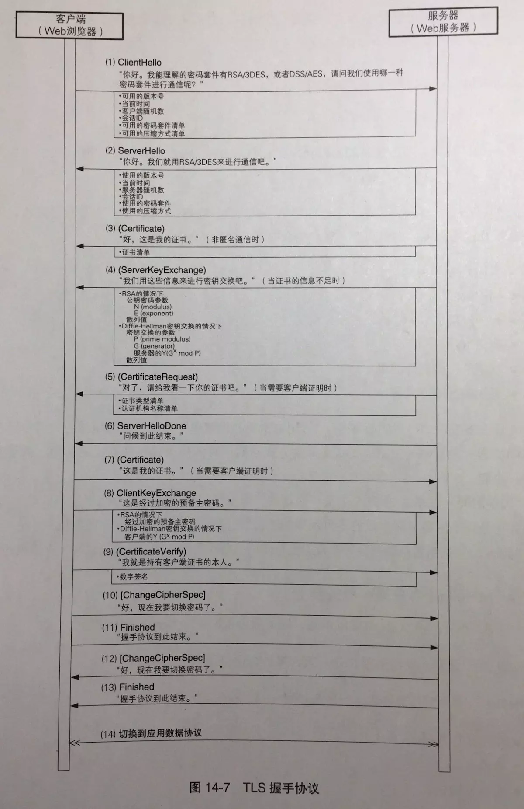
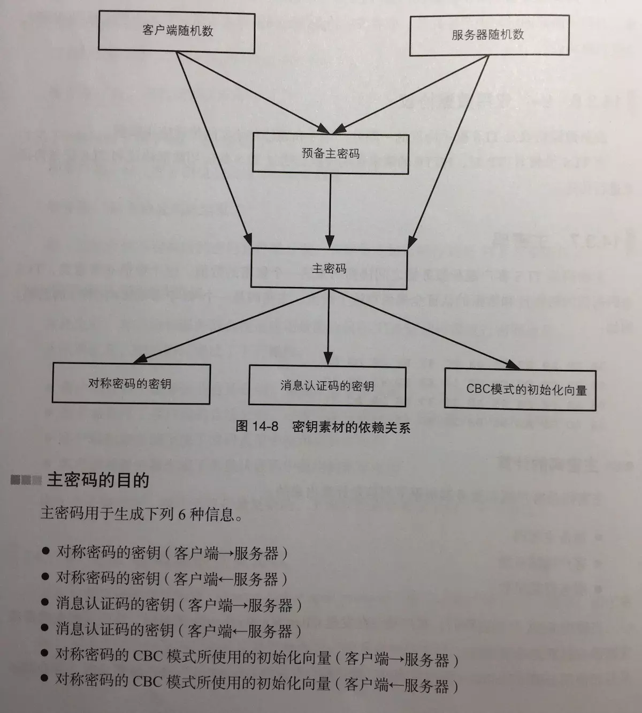

## 什么是 https?

HTTPS （全称：Hyper Text Transfer Protocol over SecureSocket Layer），是以安全为目标的 HTTP 通道。HTTPS 协议是由 HTTP 加上 TLS/SSL 协议构建的可进行加密传输、身份认证的网络协议，主要通过数字证书、加密算法、非对称密钥等技术完成互联网数据传输加密，实现互联网传输安全保护。 (HTTP+ 加密 + 认证 + 完整性保护 = HTTPS)

HTTPS 并非是应用层的一种新协议。只是 HTTP 通信接口部分用 SSL(Secure Socket Layer)和 TLS(Transport Layer Security)协议代替而已。

## 为什么需要 https？

为什么需要 https,归根结底就是因为 HTTP 的不安全。

http 存在几个不足。

- 通信使用明文,无法保证消息的保密性 (内容可能会被窃听)

- 不验证通信方的身份,无法保证消息来源的可靠性 (内容可能遭遇伪装)

- 无法验证报文的完整性和准确性 (内容可能已被篡改)

## https 的加密机制和连接过程

> 为了保证消息的保密性,就必须要加密和解密,我们先来了解下比较主流的对称加密和非对称加密。

### 1.对称加密（共享密匙加密）

> 加密和解密使用同一把密钥的方式就叫对称加密,HTTPS 一般使用的对称加密算法有:AES，RC4，3DES。

#### 对称加密的优点:

- 对称加密效率高,速度快。
- 对称加密解决了 http 中消息保密性的问题

#### 对称加密的缺点:

- 对称加密 客户端和服务器共享同一个密钥,这就意味着密钥容易泄露,安全性也就比较低。

- 因为密匙泄露风险较高，所以很难保证消息来源的可靠性、消息的完整性和准确性。

### 2.非对称加密（公有密匙加密）

> 非对称加密 有两把密钥，通常一把叫做公钥、一把叫做私钥，用公钥加密的内容必须用私钥才能解开，同样，私钥加密的内容只有公钥能解开,HTTPS 一般使用的非对称加密算法有:RSA，DSA/DSS。

#### 非对称加密的优点:

- 非对称加密采用公有密匙和私有密匙的方式，解决了 http 中消息保密性问题，而且使得私有密匙泄露的风险降低。

- 因为公匙加密的消息只有对应的私匙才能解开，所以较大程度上保证了消息的来源性以及消息的准确性和完整性。

#### 非对称加密的缺点:

- 非对称加密效率低,速度慢,非对称加密的性能相对对称加密来说会慢上几倍甚至几百倍，比较消耗系统资源。

- 非对称加密时需要使用到接收方的公匙对消息进行加密，但是公匙不是保密的，任何人都可以拿到，中间人也可以。那么中间人可以做两件事，第一件是中间人可以在客户端与服务器交换公匙的时候，将客户端的公匙替换成自己的。这样服务器拿到的公匙将不是客户端的，而是服务器的。服务器也无法判断公匙来源的正确性。第二件是中间人可以不替换公匙，但是他可以截获客户端发来的消息，然后篡改，然后用服务器的公匙加密再发往服务器，服务器将收到错误的消息。

### 非对称加密+对称加密

既然非对称加密耗时，非对称加密+对称加密结合可以吗？而且得尽量减少非对称加密的次数。当然是可以的，而且非对称加密、解密各只需用一次即可。

1.某网站拥有用于非对称加密的公钥 A、私钥 A’。

2.浏览器像网站服务器请求，服务器把公钥 A 明文给传输浏览器。

3.浏览器随机生成一个用于对称加密的密钥 X，用公钥 A 加密后传给服务器。

4.服务器拿到后用私钥 A’解密得到密钥 X。

5.这样双方就都拥有密钥 X 了，且别人无法知道它。之后双方所有数据都用密钥 X 加密解密。

### 中间人攻击

中间人的确无法得到浏览器生成的密钥 B，这个密钥本身被公钥 A 加密了，只有服务器才有私钥 A’解开拿到它呀！然而中间人却完全不需要拿到密钥 A’就能干坏事了。请看：

1.某网站拥有用于非对称加密的公钥 A、私钥 A’。

2.浏览器向网站服务器请求，服务器把公钥 A 明文给传输浏览器。

3.中间人劫持到公钥 A，保存下来，把数据包中的公钥 A 替换成自己伪造的公钥 B（它当然也拥有公钥 B 对应的私钥 B’）。

4.浏览器随机生成一个用于对称加密的密钥 X，用公钥 B（浏览器不知道公钥被替换了）加密后传给服务器。

5.中间人劫持后用私钥 B’解密得到密钥 X，再用公钥 A 加密后传给服务器。

6.服务器拿到后用私钥 A’解密得到密钥 X。

这样在双方都不会发现异常的情况下，中间人得到了密钥 B。**根本原因是浏览器无法确认自己收到的公钥是不是网站自己的。**

#### 如何证明浏览器收到的公钥一定是该网站的公钥？

现实生活中，如果想证明某身份证号一定是小明的，怎么办？看身份证。这里政府机构起到了“公信”的作用，身份证是由它颁发的，它本身的权威可以对一个人的身份信息作出证明。互联网中能不能搞这么个公信机构呢？给网站颁发一个“身份证”？

### 数字证书

我们知道，之所以非对称加密会不安全，是因为客户端不知道这把公钥是否是服务器的，因此，我们需要找到一种策略来证明这把公钥就是服务器的，而不是别人冒充的。

解决这个问题的方式就是使用数字证书 :

我们需要找到一个拥有公信力、大家都认可的**认证中心(CA)**。

### 如何放防止数字证书被篡改？

我们把证书内容生成一份“签名”，比对证书内容和签名是否一致就能察觉是否被篡改。这种技术就叫数字签名：

### 数字签名

下面左侧是数字签名的制作过程,右侧是验证过程

数字签名的制作过程：

1. CA 拥有非对称加密的私钥和公钥。
2. CA 对证书明文信息(服务器个人信息+服务器公钥)进行 hash 得到信息摘要。

3. 对 hash 后的值用私钥加密，得到数字签名。

明文和数字签名共同组成了数字证书，这样一份数字证书就可以颁发给网站了。

那浏览器拿到服务器传来的数字证书后，如何验证它是不是真的？（有没有被篡改、掉包）

浏览器验证过程：

1.  拿到证书，得到明文 T，数字签名 S。

2.  用 CA 机构的公钥对 S 解密（由于是浏览器信任的机构，所以浏览器保有它的公钥。详情见下文），得到 S’。

3.  用证书里说明的 hash 算法对明文 T 进行 hash 得到 T’。

4.  比较 S’是否等于 T’，等于则表明证书可信。

为什么这样可以证明证书可信呢？我们来仔细想一下。

### 中间人有可能篡改该证书吗？

假设中间人篡改了证书的原文，由于他没有 CA 机构的私钥，所以无法得到此时加密后签名，无法相应地篡改签名。浏览器收到该证书后会发现原文和签名解密后的值不一致，则说明证书已被篡改，证书不可信，从而终止向服务器传输信息，防止信息泄露给中间人。

既然不可能篡改，那整个证书被调包呢？

### 中间人有可能把证书调包吗？

假设有另一个网站 B 也拿到了 CA 机构认证的证书，它想搞垮网站 A，想劫持网站 A 的信息。于是它成为中间人拦截到了 A 传给浏览器的证书，然后替换成自己的证书，传给浏览器，之后浏览器就会错误地拿到 B 的证书里的公钥了，会导致上文提到的漏洞。
其实这并不会发生，因为证书里包含了网站 A 的信息，包括域名，浏览器把证书里的域名与自己请求的域名比对一下就知道有没有被调包了。

### 为什么制作数字签名时需要 hash 一次？

我初学 HTTPS 的时候就有这个问题，似乎以上过程中 hash 有点多余，把 hash 过程去掉也能保证证书没有被篡改。
最显然的是性能问题，前面我们已经说了非对称加密效率较差，证书信息一般较长，比较耗时。而 hash 后得到的是固定长度的信息（比如用 md5 算法 hash 后可以得到固定的 128 位的值），这样加密解密就会快很多。
当然还有安全上的原因，这部分内容相对深一些，感兴趣的可以看这篇解答：[crypto.stackexchange.com/a/12780](crypto.stackexchange.com/a/12780)

### 怎么证明 CA 机构的公钥是可信的？

你们可能会发现上文中说到 CA 机构的公钥，我几乎一笔带过，“浏览器保有它的公钥”，这是个什么保有法？怎么证明这个公钥是否可信？
让我们回想一下数字证书到底是干啥的？没错，为了证明某公钥是可信的，即“该公钥是否对应该网站/机构等”，那这个 CA 机构的公钥是不是也可以用数字证书来证明？没错，操作系统、浏览器本身会预装一些它们信任的根证书，如果其中有该 CA 机构的根证书，那就可以拿到它对应的可信公钥了。
实际上证书之间的认证也可以不止一层，可以 A 信任 B，B 信任 C，以此类推，我们把它叫做信任链或数字证书链，也就是一连串的数字证书，由根证书为起点，透过层层信任，使终端实体证书的持有者可以获得转授的信任，以证明身份。
另外，不知你们是否遇到过网站访问不了、提示要安装证书的情况？这里安装的就是跟证书。说明浏览器不认给这个网站颁发证书的机构，那么没有该机构的根证书，你就得手动下载安装（风险自己承担 XD）。安装该机构的根证书后，你就有了它的公钥，就可以用它验证服务器发来的证书是否可信了。

### HTTPS 必须在每次请求中都要先在 SSL/TLS 层进行握手传输密钥吗？

这也是我当时的困惑之一，显然每次请求都经历一次密钥传输过程非常耗时，那怎么达到只传输一次呢？用 session 就行。
服务器会为每个浏览器（或客户端软件）维护一个 session ID，在 TSL 握手阶段传给浏览器，浏览器生成好密钥传给服务器后，服务器会把该密钥存到相应的 session ID 下，之后浏览器每次请求都会携带 session ID，服务器会根据 session ID 找到相应的密钥并进行解密加密操作，这样就不必要每次重新制作、传输密钥了！

### https 连接建立过程

1. 客户端通过发送 Client Hello 报文开始 SSL 通信。报文中包含客户端支持的 SSL 的指定版本、加密组件(Cipher Suite)列表(所使用的加密算法及密钥长度等)

2. 服务器可进行 SSL 通信时，会以 Server Hello 报文作为应答。和客户端一样，在报文中包含 SSL 版本以及加密组件。服务器的加密组件内容是从接收 到的客户端加密组件内筛选出来的。

3. 之后服务器发送 Certificate 报文。报文中包含公开密钥证书。

4. 最后服务器发送 Server Hello Done 报文通知客户端，最初阶段的 SSL 握手协商部分结束。

5. SSL 第一次握手结束之后，客户端以 Client Key Exchange 报文作为回应。报文中包含通信加密中使用的一种被称为 Pre-master secret 的随机密码串。该 报文已用步骤 3 中的公开密钥进行加密。

6. 接着客户端继续发送 Change Cipher Spec 报文。该报文会提示服务器，在此报文之后的通信会采用 Pre-master secret 密钥加密。

7. 客户端发送 Finished 报文。该报文包含连接至今全部报文的整体校验值。这次握手协商是否能够成功，要以服务器是否能够正确解密该报文作为判定标准。

8. 服务器同样发送 Change Cipher Spec 报文。

9. 服务器同样发送 Finished 报文。

10. 服务器和客户端的 Finished 报文交换完毕之后，SSL 连接就算建立完成。当然，通信会受到 SSL 的保护。从此处开始进行应用层协议的通信，即发 送 HTTP 请求。

11. 应用层协议通信，即发送 HTTP 响应。

12. 最后由客户端断开连接。断开连接时，发送 close_notify 报文。

以上做了一些省略，这步之后再发送 TCP FIN 报文来关闭与 TCP 的通信。

在以上流程中，应用层发送数据时会附加一种叫做 MAC(Message Authentication Code)的报文摘要。MAC 能够查知报文是否遭到篡改，从而保护报文的完整性。

### 密钥关系图

## https 的缺陷

https 比 http 慢，《图解 http》书中原文如下：

> “HTTPS 比 HTTP 要慢 2 到 100 倍：SSL 的慢分两种。一种是指通信慢。另一种是指由于大量消耗 CPU 及内存等资源，导致处理速度变慢。

> 和使用 HTTP 相比，网络负载可能会变慢 2 到 100 倍。除去和 TCP 连接、发送 HTTP 请求·响应以外，还必须进行 SSL 通信，因此整体上处理通信量不可避免会增加。”

> 另一点是 SSL 必须进行加密处理。在服务器和客户端都需要进行加密和解密的运算处理。因此从结果上讲，比起 HTTP 会更多地消耗服务器和客户端的硬件资源，导致负载增强。”。

## 参考文献

[彻底搞懂 HTTPS 的加密机制-lvan YGY](https://zhuanlan.zhihu.com/p/43789231)

[一文看懂 https 如何保证数据传输的安全性](https://www.cnblogs.com/kubidemanong/p/9390021.html)

[https 连接建立过程](https://www.jianshu.com/p/d36e31f664ca)

[带你从零到一理解 HTTPS](https://juejin.im/post/5a2fd1216fb9a045204c315e)
