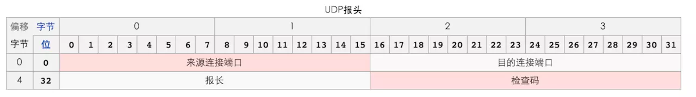
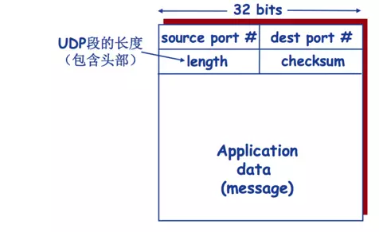
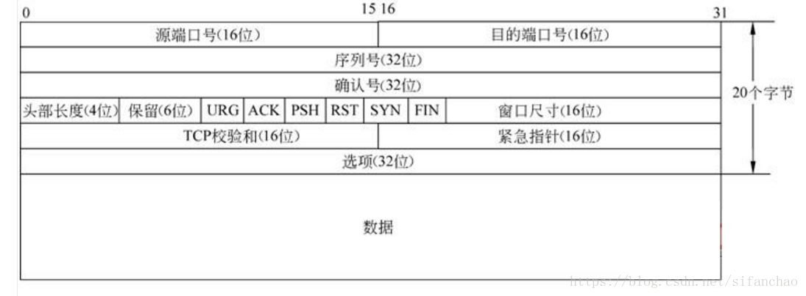

## TCP 和 UDP

1、TCP 面向连接（要先建立连接）;UDP 是无连接的，即发送数据之前不需要建立连接

2、TCP 提供可靠的服务。也就是说，通过 TCP 连接传送的数据，无差错，不丢失，不重复，且按序到达;UDP 尽最大努力交付，即不保证可靠交付

Tcp 通过校验和，重传控制，序号标识，确认应答实现可靠传输。如丢包时的重发，还可以对次序乱掉的分包进行顺序控制。

3、UDP 具有较好的实时性，工作效率比 TCP 高，适用于对高速传输和实时性有较高的通信或广播通信。

4.每一条 TCP 连接只能是点到点的;UDP 支持一对一，一对多，多对一和多对多的交互通信

5、TCP 对系统资源要求较多，UDP 对系统资源要求较少。

## whats' UDP

> 用户数据报协议（英语：User Datagram Protocol，缩写为 UDP），又称使用者资料包协定，是一个简单的面向数据报的传输层协议，正式规范为 RFC 768。在 TCP/IP 模型中，UDP 为网络层以上和应用层以下提供了一个简单的接口。UDP 只提供数据的不可靠传递，它一旦把应用程序发给网络层的数据发送出去，就不保留数据备份（所以 UDP 有时候也被认为是不可靠的数据报协议）。UDP 在 IP 数据报的头部仅仅加入了复用和数据校验（字段）。
> -from wiki

### UPD 的优点

- 无需建立连接（减少延迟）
- 实现简单：无需维护连接状态
- 头部开销小（最小值为 8byte）
- 没有拥塞控制：应用可以更好的控制发送时间和发送速率

### UDP 头部：

> UDP 的头部是由源端口号、目标端口号、包长和校验 4 个部分组成，其中两个是可选的。各 16bit 的来源端口和目的端口用来标记发送和接受的应用进程。因为 UDP 不需要应答，所以来源端口是可选的，如果来源端口不用，那么置为零。在目的端口后面是长度固定的以字节为单位的长度域，用来指定 UDP 数据报包括数据部分的长度，长度最小值为 8byte。首部剩下地 16bit 是用来对首部和数据部分一起做校验和（Checksum）的，checksum 主要是用来检测 UDP 段在传输中是否发生了错误。还有就是，校验和计算中也需要计算 UDP 伪头部，伪头部包含 IP 头部的一些字段。我们刚才介绍了识别一个通信需要 5 项信息，而 UDP 头部只有端口号，余下的三项在 IP 头部，所以引入了伪头部的概念。（IPv6 的 IP 头部没有校验和字段）

### 基于 UDP 协议的有:

- 域名系统（DNS）
- 简单网络管理协议（SNMP）
- 动态主机配置协议（DHCP）
- 路由信息协议（RIP）
- 自举协议（BOOTP）
- 简单文件传输协议（TFTP）

## what's TCP

> 传输控制协议（英语：Transmission Control Protocol）是一种面向连接的、可靠的、基于字节流的传输层通信协议，由 IETF 的 RFC 793 定义。在因特网协议族（Internet protocol suite）中，TCP 层是位于 IP 层之上，应用层之下的中间层。不同主机的应用层之间经常需要可靠的、像管道一样的连接，但是 IP 层不提供这样的流机制，而是提供不可靠的包交换。应用层向 TCP 层发送用于网间传输的、用 8 位字节表示的数据流，然后 TCP 把数据流分区成适当长度的报文段（通常受该计算机连接的网络的数据链路层的最大传输单元（MTU）的限制）。之后 TCP 把结果包传给 IP 层，由它来通过网络将包传送给接收端实体的 TCP 层。TCP 为了保证不发生丢包，就给每个包一个序号，同时序号也保证了传送到接收端实体的包的按序接收。然后接收端实体对已成功收到的包发回一个相应的确认（ACK）；如果发送端实体在合理的往返时延（RTT）内未收到确认，那么对应的数据包就被假设为已丢失将会被进行重传。TCP 用一个校验和函数来检验数据是否有错误；在发送和接收时都要计算校验和

### TCP 的优点

- 可靠，稳定
- 有确认、窗口、重传、拥塞控制机制
- TCP 提供全双工通信

### TCP 头部：

### 基于 TCP 实现的协议有：

- HTTP/HTTPS，
- Telnet
- FTP
- SMTP

## 区别

|              |                        UDP                         |                       TCP                       |
| :----------: | :------------------------------------------------: | :---------------------------------------------: |
|   是否连接   |                       无连接                       |                    面向连接                     |
|   是否可靠   |        不可靠传输，不使用流量控制和拥塞控制        |        可靠传输，使用流量控制和拥塞控制         |
| 连接对象个数 |     支持一对一，一对多，多对一和多对多交互通信     |                  只能是点到点                   |
|   传输方式   |                      面向报文                      |                   面向字节流                    |
|   首部开销   |               首部开销小，仅 8 字节                |         首部最小 20 字节，最大 60 字节          |
|   适用场景   | 传输快,适用于实时应用（IP 电话、视频会议、直播等） | 传输可靠,适用于要求可靠传输的应用，例如文件传输 |

## 简单实践

[tcp](./code/tcp)

[udp](./code/upd)
