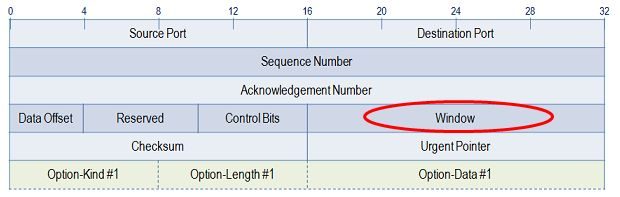
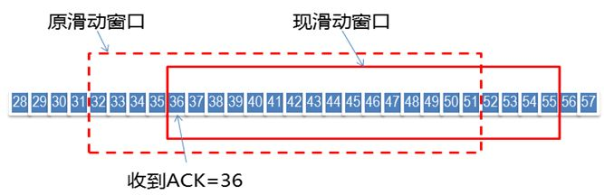
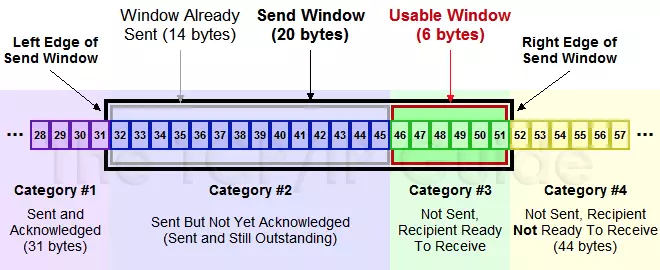
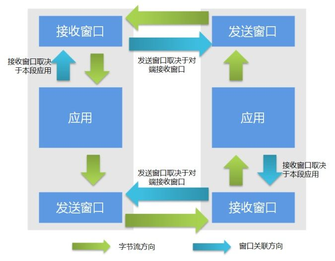
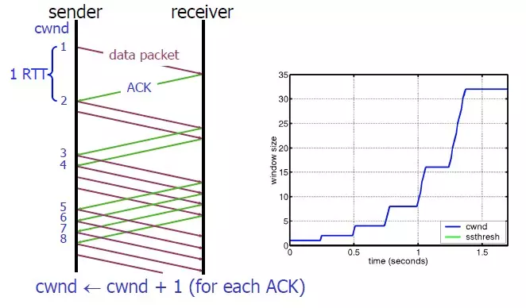
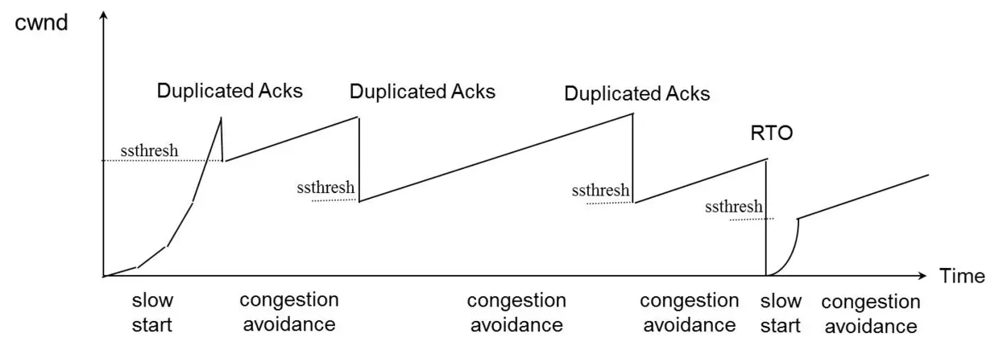

## TCP 流量控制 (Flow Control)

### 什么是流量控制?

如果发送者发送数据过快，接收者来不及接收，那么就会有分组丢失。为了避免分组丢失，控制发送者的发送速度，使得接收者来得及接收，这就是流量控制。流量控制根本目的是防止分组丢失，它是构成 TCP 可靠性的一方面。

### 流量控制是如何实现的？

由滑动窗口协议（连续 ARQ 协议）实现。滑动窗口协议既保证了分组无差错、有序接收，也实现了流量控制。

### TCP 滑动窗口 (Sliding Window)

滑动窗口协议是传输层进行流控的一种措施，接收方通过通告发送方自己的窗口大小，从而控制发送方的发送速度，从而达到防止发送方发送速度过快而导致自己被淹没的目的。

TCP 头里有一个字段叫 Window（或 Advertised Window），用于接收方通知发送方自己还有多少缓冲区可以接收数据。Window 是一个 16bit 位字段,TCP 的标准窗口最大为 2^16-1=65535 个字节。

另外在 TCP 的选项字段中还包含了一个 TCP 窗口扩大因子，option-kind 为 3，option-length 为 3 个字节，option-data 取值范围 0-14。窗口扩大因子用来扩大 TCP 窗口，可把原来 16bit 的窗口，扩大为 31bit。

对 ACK 的再认识，ack 通常被理解为收到数据后给出的一个确认 ACK，ACK 包含两个非常重要的信息：

**一是期望接收到的下一字节的序号 n，该 n 代表接收方已经接收到了前 n-1 字节数据，此时如果接收方收到第 n+1 字节数据而不是第 n 字节数据，接收方是不会发送序号为 n+2 的 ACK 的。**
举个例子，假如接收端收到 1-1024 字节，它会发送一个确认号为 1025 的 ACK,但是接下来收到的是 2049-3072，它是不会发送确认号为 3072 的 ACK,而依旧发送 1025 的 ACK。

**二是当前的窗口大小 m，如此发送方在接收到 ACK 包含的这两个数据后就可以计算出还可以发送多少字节的数据给对方，假定当前发送方已发送到第 x 字节，则可以发送的字节数就是 y=m-(x-n).这就是滑动窗口控制流量的基本原理**

**重点：发送方根据收到 ACK 当中的期望收到的下一个字节的序号 n 以及窗口 m，还有当前已经发送的字节序号 x，算出还可以发送的字节数。**

**发送端窗口的第一个字节序号一定是 ACK 中期望收到的下一个字节序号，比如下图：**

由上图,我们可以看到当前发送方已发送到第 51(x) 字节,ACK 序号为 36(n),窗口大小 为 19(m),那我们就可以算出还可以发送的字节数为

**y=m-(x-n)**

**19-(51-36) = 4 个字节, 从 51 开始往后数 4 个字节, 52 53 54 55 就是可以新发送的字节序。**

**接受端窗口的第一个字节序之前一定是已经完全接收的，后面窗口里面的数据都是希望接受的，窗口后面的数据都是不希望接受的。**

**TCP 滑动窗口分为接受窗口，发送窗口。**

以下是一个发送缓冲区的滑动窗口:

对于 TCP 会话的发送方,任何时候缓冲区数据存在四种情况:

1. 已经发送并得到对端 ACK
2. 已经发送但还未收到对端 ACK
3. 未发送但对端允许发送
4. 未发送且对端不允许发送

其中 2 和 3 这两部分数据称为发送窗口。

对于 TCP 会话的接收方,某些时候缓冲区数据存在三种情况:

1. 已接收
2. 未接收准备接收
3. 未接收并未准备接收

其中 2 这部分数据称为接收窗口。

所以 #2 + #3 组成了滑动窗口

#### 发送窗口与接收窗口关系

TCP 是双工的协议，会话的双方都可以同时接收、发送数据。TCP 会话的双方都各自维护一个“发送窗口”和一个“接收窗口”。其中各自的“接收窗口”大小取决于应用、系统、硬件的限制（TCP 传输速率不能大于应用的数据处理速率）。各自的“发送窗口”则要求取决于对端通告的“接收窗口”，要求相同。

#### 滑动窗口实现面向流的可靠性

1. 最基本的传输可靠性来源于“确认重传”机制。

2. TCP 的滑动窗口的可靠性也是建立在“确认重传”基础上的。

3. 发送窗口只有收到对端对于本段发送窗口内字节的 ACK 确认，才会移动发送窗口的左边界。

4. 接收窗口只有在前面所有的段都确认的情况下才会移动左边界。当在前面还有字节未接收但收到后面字节的情况下，窗口不会移动，并不对后续字节确认。以此确保对端会对这些数据重传。

#### 滑动窗口的流控特性

TCP 的滑动窗口是动态的，我们可以想象成小学常见的一个数学题，一个水池，体积 V，每小时进水量 V1，出水量 V2。当水池满了就不允许再注入了，如果有个液压系统控制水池大小，那么就可以控制水的注入速率和量。这样的水池就类似 TCP 的窗口。应用根据自身的处理能力变化，通过本端 TCP 接收窗口大小控制来对对对端的发送窗口流量限制。

应用程序在需要（如内存不足）时，通过 API 通知 TCP 协议栈缩小 TCP 的接收窗口。然后 TCP 协议栈在下个段发送时包含新的窗口大小通知给对端，对端按通知的窗口来改变发送窗口，以此达到减缓发送速率的目的。

## TCP 拥塞控制 (Congestion Control)

### 什么是拥塞控制?

到达通信子网中某一部分的分组数量过多，使得该部分网络来不及处理，以致引起这部分乃至整个网络性能下降的现象，严重时甚至会导致网络通信业务陷入停顿即出现死锁。

### 拥塞控制是如何实现的？

**拥塞发生前，可避免流量过快增长拖垮网络；拥塞发生时，唯一的选择就是降低流量。** 主要使用 4 种算法完成拥塞控制:

1. 慢启动
2. 拥塞避免
3. 快重传
4. 快恢复

### rwnd（Receiver Window，接收者窗口） 与 cwnd（Congestion Window，拥塞窗口）

- rwnd 是用于流量控制的窗口大小，即上述流量控制中的 AdvertisedWindow，主要取决于接收方的处理速度，由接收方通知发送方被动调整

- cwnd 是用于拥塞处理的窗口大小，取决于网络状况，由发送方探查网络主动调整。

介绍流量控制时，我们没有考虑 cwnd，认为发送方的滑动窗口最大即为 rwnd。实际上，需要同时考虑流量控制与拥塞处理，则发送方窗口的大小不超过 min{rwnd, cwnd}。下述 4 种拥塞控制算法只涉及对 cwnd 的调整，同介绍流量控制时一样，暂且不考虑 rwnd，假定滑动窗口最大为 cwnd；但读者应明确 rwnd、cwnd 与发送方窗口大小的关系。

### 慢启动算法

慢启动算法（Slow Start）作用在拥塞产生之前：对于刚刚加入网络的连接，要一点一点的提速，不要妄图一步到位。如下：

1. 连接刚建好，初始化 cwnd = 1（当然，通常不会初始化为 1，太小），表明可以传一个 MSS 大小的数据。
2. 每收到一个 ACK，cwnd++，线性增长。
3. 每经过一个 RTT，cwnd = cwnd \* 2，指数增长（主要增长来源）。
4. 还有一个 ssthresh（slow start threshold），当 cwnd >= ssthresh 时，就会进入拥塞避免算法（见后）。

因此，如果网速很快的话，Ack 返回快，RTT 短，那么，这个慢启动就一点也不慢。下图说明了这个过程：

### 拥塞避免算法

前面说过，当 cwnd >= ssthresh（通常 ssthresh = 65535）时，就会进入拥塞避免算法（Congestion Avoidance）：缓慢增长，小心翼翼的找到最优值。如下：

1. 每收到一个 Ack，cwnd = cwnd + 1/cwnd，显然，cwnd > 1 时无增长。

2. 每经过一个 RTT，cwnd++，线性增长（主要增长来源）。

慢启动算法主要呈指数增长，粗犷型，速度快（“慢”是相对于一步到位而言的）；而拥塞避免算法主要呈线性增长，精细型，速度慢，但更容易在不导致拥塞的情况下，找到网络环境的 cwnd 最优值。

### 快重传算法

慢启动与拥塞避免算法作用在拥塞发生前，采取不同的策略增大 cwnd；如果已经发生拥塞，则需要采取策略减小 cwnd。那么，TCP 如何判断当前网络拥塞了呢？很简单，**如果发送方发现有 Seq 发送失败（表现为“丢包”），就认为网络拥塞了。**

丢包后，有两种重传方式，对应不同的网络情况，也就对应着两种拥塞发生时的控制算法：

1. 超时重传。TCP 认为这种情况太糟糕，调整力度比较大：

- ssthresh = cwnd /2

- cwnd = 1，重新进入慢启动过程（网络糟糕，要慢慢调整）

2. 快速重传。TCP 认为这种情况通常比 RTO 超时好一些，主流实现 TCP Reno 的调整力度更柔和（TCP Tahoe 的实现和 RTO 超时一样暴躁）：

- ssthresh = cwnd /2

- cwnd = cwnd /2，进入快速恢复算法（网络没那么糟，可以快速调整，见下）

可以看到，不管是哪种重传方式，ssthresh 都会变成 cwnd 的一半，仍然是*指数回退，待拥塞消失后再逐渐增长回到新的最优值*，总体上在最优值（动态）附近震荡。

回退后，根据不同的网络情况，可以选择不同的恢复算法。慢启动已经介绍过了，下面介绍快速恢复算法。

### 快速恢复算法

如果触发了快速重传，即发送方收到至少 3 次相同的 Ack，那么 TCP 认为网络情况不那么糟，也就没必要提心吊胆的，可以适当大胆的恢复。为此设计快速恢复算法（Fast Recovery），下面介绍 TCP Reno 中的实现。

回顾一下，进入快速恢复之前，cwnd 和 sshthresh 已被更新：

1. ssthresh = cwnd /2
2. cwnd = cwnd /2

然后，进入快速恢复算法：

1. cwnd = ssthresh + 3 \* MSS （尝试一步到位）
2. 重传重复 Ack 对应的 Seq
3. 如果再收到该重复 Ack，则 cwnd++，线性增长（缓慢调整）
4. 如果收到了新 Ack，则 cwnd = ssthresh ，然后就进入了拥塞避免的算法了

### 示例

## 流量控制和拥塞控制的区别

流量控制：流量控制是作用于接收者的，它是控制发送者的发送速度从而使接收者来得及接收，防止分组丢失的。

拥塞控制：拥塞控制是作用于网络的，它是防止过多的数据注入到网络中，避免出现网络负载过大的情况。

## 参考文献

[TCP 协议的滑动窗口具体是怎样控制流量的](https://www.zhihu.com/question/32255109)

[浅谈 TCP（2）：流量控制与拥塞控制](https://juejin.im/post/5acae2b55188252b0b2013aa)
