## 1. Codewars

[https://www.codewars.com](https://www.codewars.com/?language=javascript)

Codewars 提供了大量由他们自己的社区提交和编辑的编程挑战,在这里,你可以使用多种编程语言像打游戏升级一样进行挑战。

通过在线编辑器直接完成每项挑战。通过实战训练来提升编程开发技能。

查看关于每个挑战的讨论以及每个用户解决方案。通过挑战来获得分数和排名。

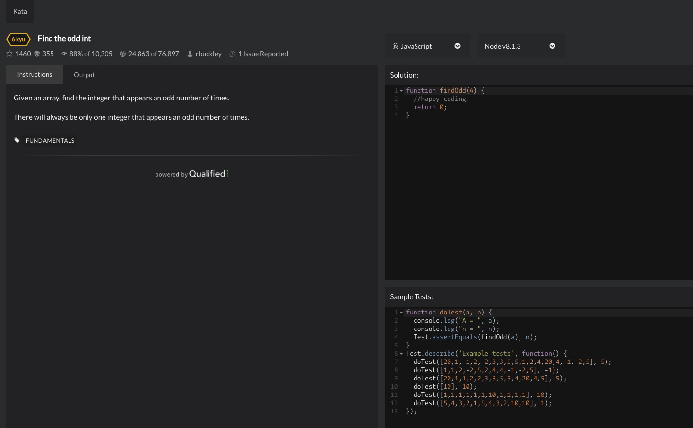

## 2. CodeFights

[https://app.codesignal.com/](https://app.codesignal.com/)

CodeFights 提供了一组编程挑战,在这里,你可以在在线编辑器中进行挑战。

在专门的用户挑战论坛中参与讨论,与“机器人”比拼！

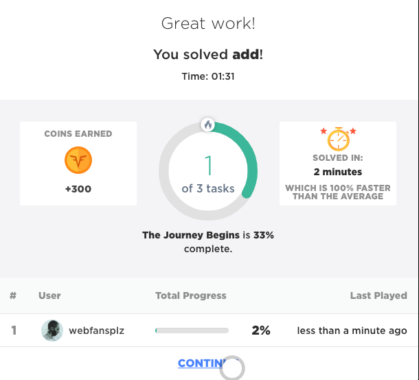

## 3. CodinGame

[https://www.codingame.com/start](https://www.codingame.com/start)

CodinGame 这个网站很特别,他跟一些竞争性编程网站有所不同。

它不是简单地通过生成一组输出来实现编程挑战,而是以玩游戏的方式通过在线编程完成相应挑战。

这是一个很棒的网站,有些游戏非常有趣,并且游戏界面和图形设计非常精美。

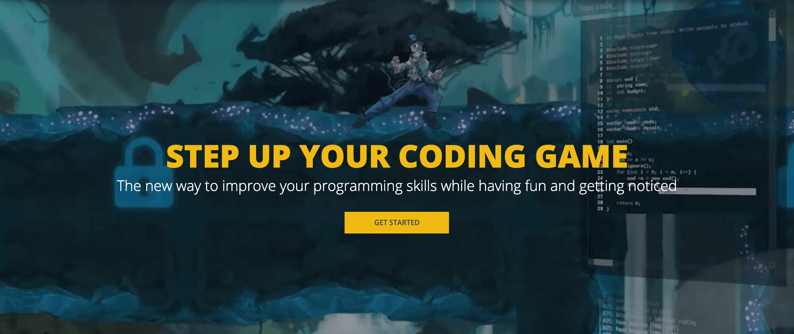

## 4. Coderbyte

[https://coderbyte.com/](https://coderbyte.com/)

Coderbyte 提供了 200 多种编程挑战。在这里,你可以:

使用 10 种编程语言中的一种进行在线挑战。

看到网站发布的大多数挑战的官方解决方案。

查看该网站其他 80 万用户为同一挑战提供的解决方案。

除了编程挑战之外,Coderbyte 还提供算法和数据结构、Web 开发等编程训练营的预备课程以及一系列关于面试准备的相应课程,被很多顶级编程训练营所推荐。

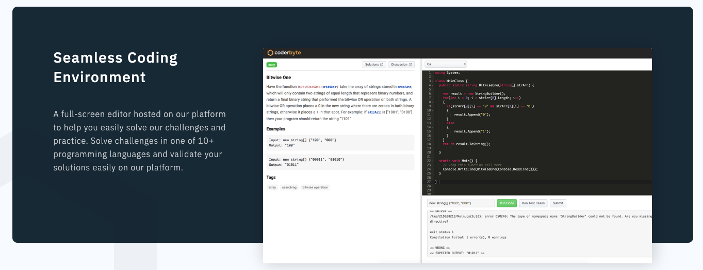

## 5. HTML Dog

[https://htmldog.com](https://htmldog.com/)

一听到这个名字相信大家就懂这个网站主要是干嘛的了,前端狗哇!!!放心,狗在国外是褒义词。

网站有 HTML,CSS, JavaScript 的教程,案例,技巧合集等等,非常值得大家去学习。

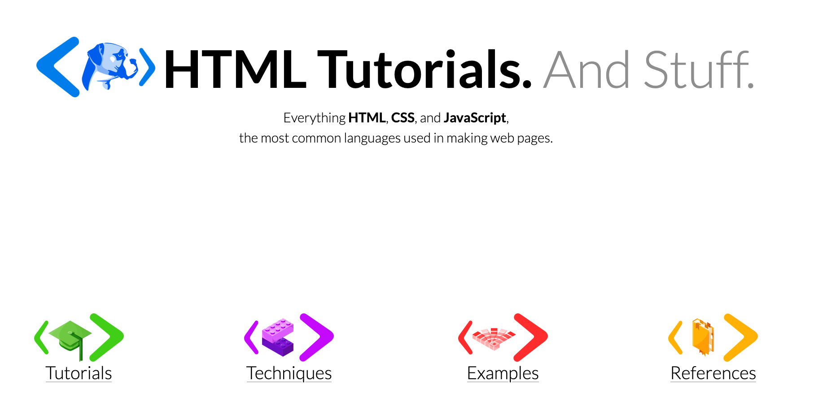

## 6. Codecademy

[https://www.codecademy.com](https://www.codecademy.com/)

这是美国纽约的一个编程教学公司。这个网站的教学并不是传统的视频授课,而是全部文字教学。

Codecademy 的大名相信大家都听过,这个就不多介绍了,免费课程很多很全面。大家真的要好好利用资源呀。

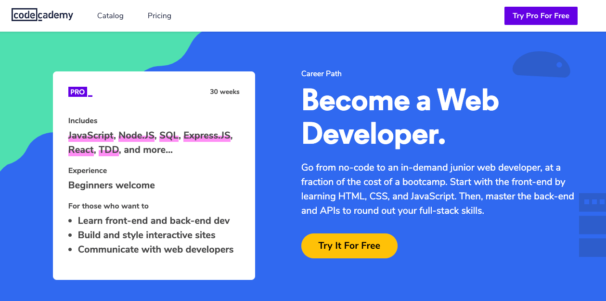

## 7. Free Code Camp

[https://www.freecodecamp.org](https://www.freecodecamp.org)

Free Code Camp 是一个非营利组织,大家可以在该平台学习 HTML,CSS 以及 JavaScript 等前端知识。

这是国外发起的一个 Web 开发学习的网站,从简单到深入,一步一步带你学习 Web 开发。就像一本练习册,并且当你完成相应的内容后,会得到相应的资格认证。

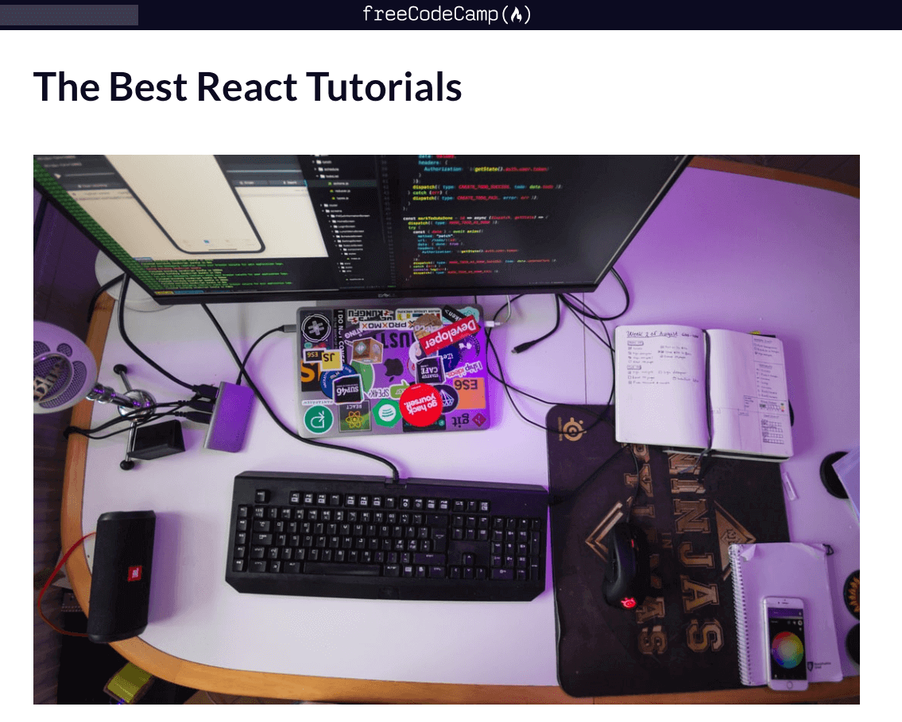

## 8. Treehouse

[https://teamtreehouse.com](https://teamtreehouse.com/learn/javascript?cid=3912)

Treehouse 是一家总部位于美国的在线技术学校,提供了很多 Web 开发课程,一起来学习吧。

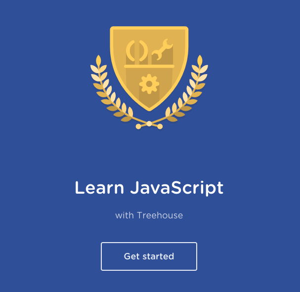

## 9. codecombat

[https://codecombat.com](https://codecombat.com)

通过游戏学习 javascript,codecombat 让你带着微笑学习,codecombat 支持中文语言哦!

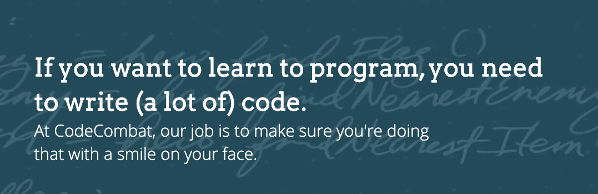

## 10. Tutsplus

[https://code.tutsplus.com/](https://code.tutsplus.com/)

资源比较多,很多课程注册后免费,且支持中文!

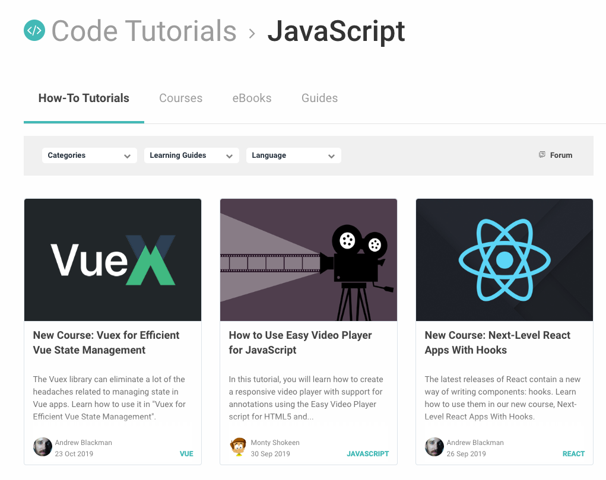

## 11. thecodeplayer

[http://thecodeplayer.com](http://thecodeplayer.com)

Learn HTML5, CSS3, Javascript

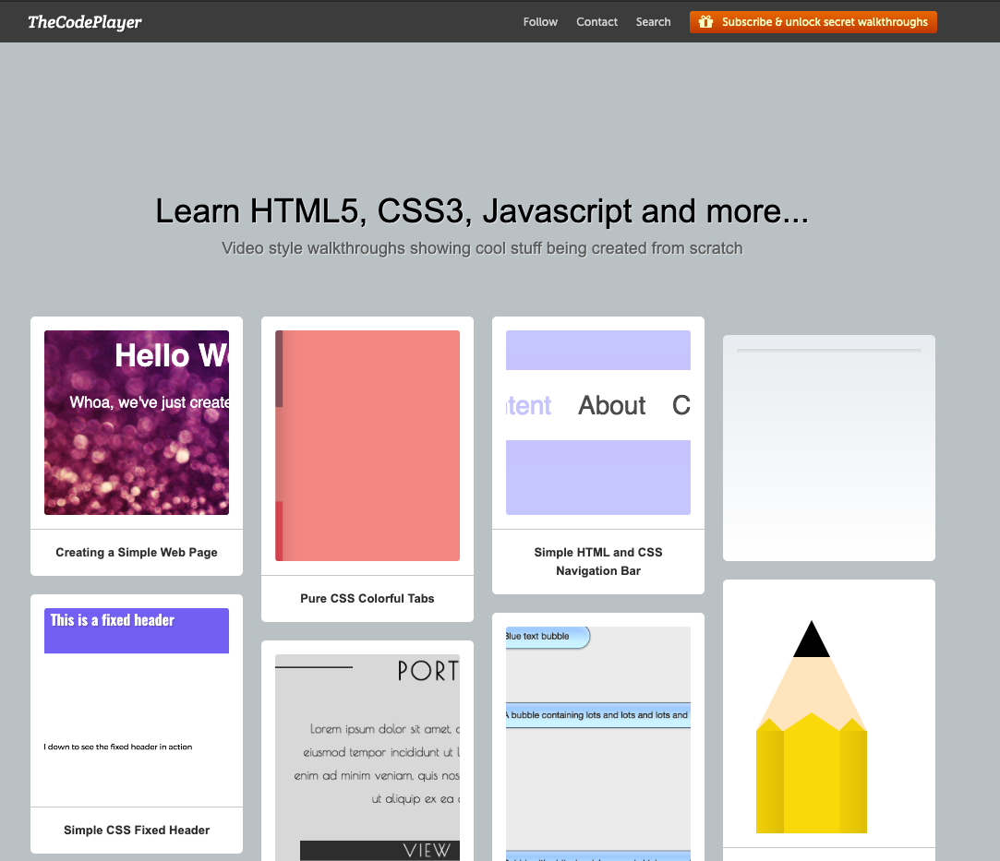

## 12. Livecoding.tv

[https://www.education-ecosystem.com/](https://www.education-ecosystem.com/)

一个专门为世界各地的程序员和编程爱好者提供的在线编程和社交平台。你可以在线看别人写代码,观看学习视频,还可以在这里找工作。覆盖的编程语言有 260 多种。

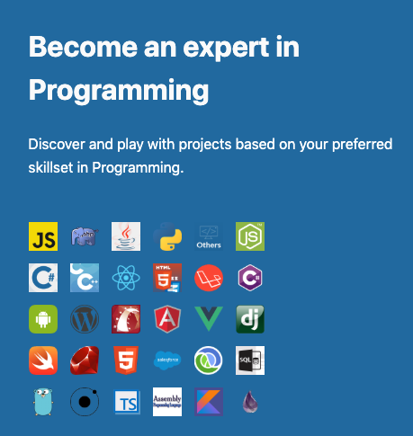

## 13. CheckiO 

[https://checkio.org](https://checkio.org)

用户可以使用 Python 和 JavaScript 玩游戏。在游戏过程中与别人交流心得,并通过别人的解决方法来提高自己的编码技巧。

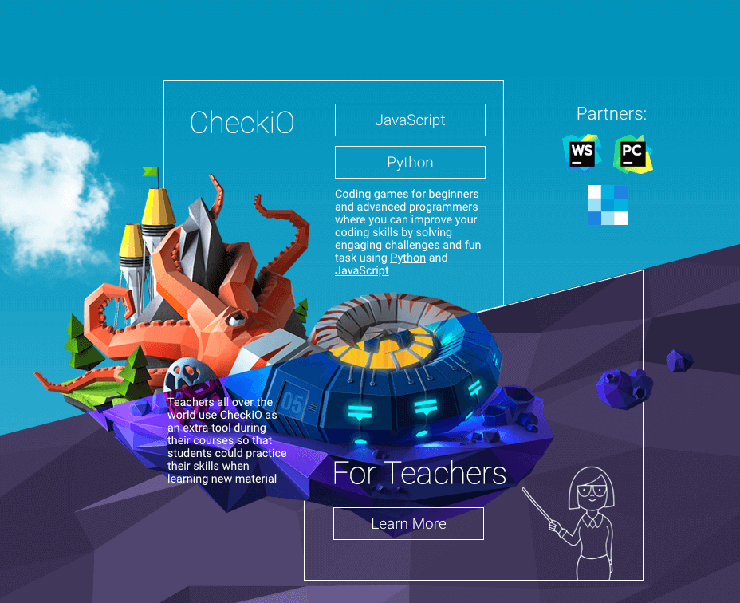

## 14. Egghead

[https://egghead.io/browse/frameworks](https://egghead.io/browse/frameworks)

这个网站汇集了目前最新的 Web 框架,为用户提供视频教材。

## 15. Exercism 

[https://exercism.io/my/tracks/javascript](https://exercism.io/my/tracks/javascript)

一个让你的编程技巧可以得到提升的网站,覆盖 30 多种不同的编程语言。

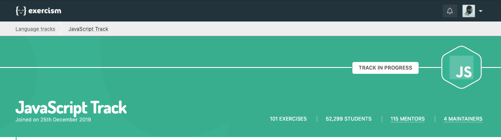

## 16. SitePoint Premium 

[https://www.sitepoint.com/premium/library](https://www.sitepoint.com/premium/library)

如果想成为更出色的 web 开发者,可以到这个网站学习。它是专门为 web 开发者设计的平台。

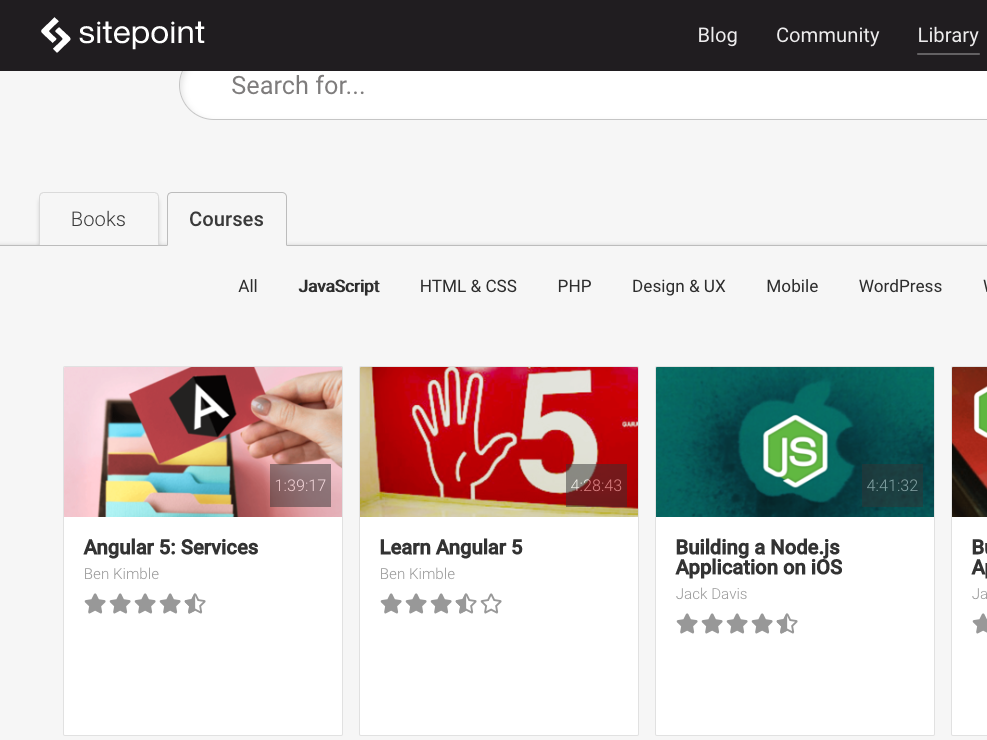

## 17. css-tricks

[https://css-tricks.com/archives](https://css-tricks.com/archives)

Daily articles about CSS, HTML, JavaScript, and all things related to web design and development.

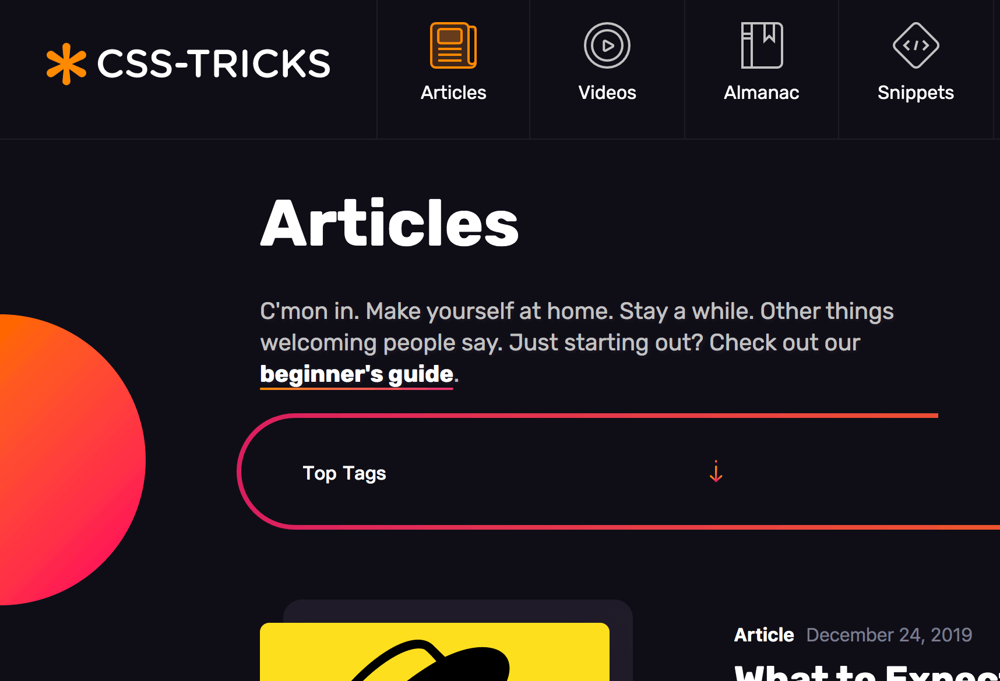

## 18. dzone

[https://dzone.com/links](https://dzone.com/links)

Over a million developers have joined DZone.

## 19. scotch

[https://scotch.io](https://scotch.io)

Fun and practical web development. Not just how, but why.

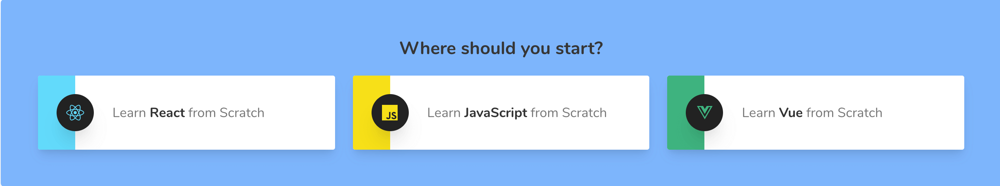

## 20. frontendmasters

[https://frontendmasters.com](https://frontendmasters.com)

Advance Your Skills with In-Depth, Modern Front-End Engineering Courses

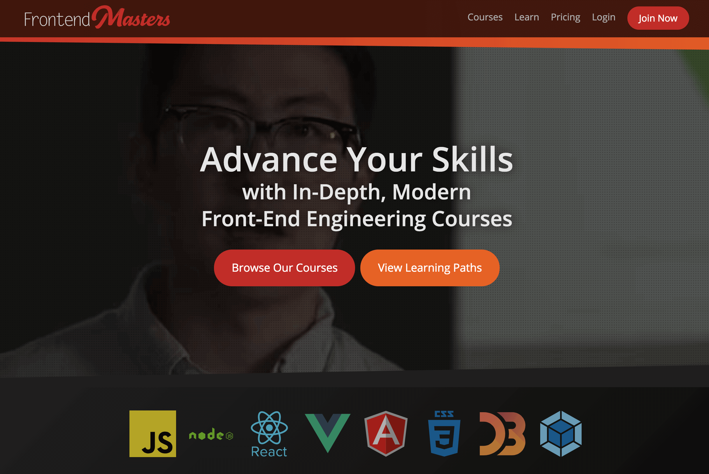
